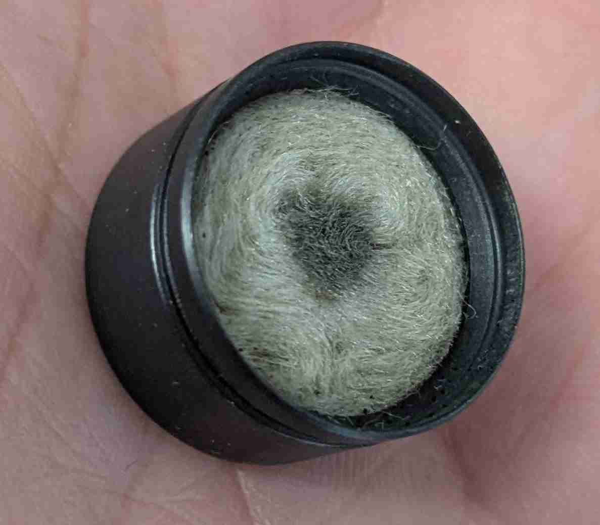

# Abgasmessung

## Feuerungskontrolle: Grenzwerte eingehalten
Unsere Heizung wird vom Feuerungskontrolleur abgenommen. 

 
Messeinrichtung

 
Ein Keramikfilter für die Messung der Feststoffmenge. Der Filter auf dem Foto ist grau und verbraucht. Feinstaub und grobe Aschepartikel können bei dieser Messmethode nicht unterschieden werden.

 
Wir müssen diese Grenzwerte einhalten.

 
Messresultate.

 
Diskussion:

- Alle unsere 4 Brenner unterschreiten die Grenzwerte deutlich.
- Die Messung dauert jeweils 30 Minuten. Kohlenmonoxid und Feststoffgehalt wird über die 30 Minuten gemittelt. 
- Die Messung ist nicht "genau". Die Werte schwanken über die Messzeit. Wenn ein Brenner Pellets saugt, wenn er die Wärmetauscher reinigt usw. hat das einen grossen Einfluss. Bei einem solchen Ereignis, falls der Grenzwert überschritten wird, wird die Messung verworfen und wiederholt.

### Erste Messung, schlechte Abgaswerte

Puent brenner_1 ist bei der ersten Messung durch gefallen. Kolenmonoxid wie auf Feststoffgehalt waren massiv über dem Grenzwert. Die Ursache waren viele Pellets welche über den Brenntellerrand gefallen waren und unten in der Asche verglühten. 
Wir haben das schon ein paar mal beobachtet. Bei einem Kaltstart funktioniert die Zündung nicht auf Anhieb und es werden massiv zu viele Pellets gefördert.
Zum Glück durften wird die Messung wiederholen.

Foto: Brennraum mit heruntergefallenen Pellets welche in der Asche glühen.

