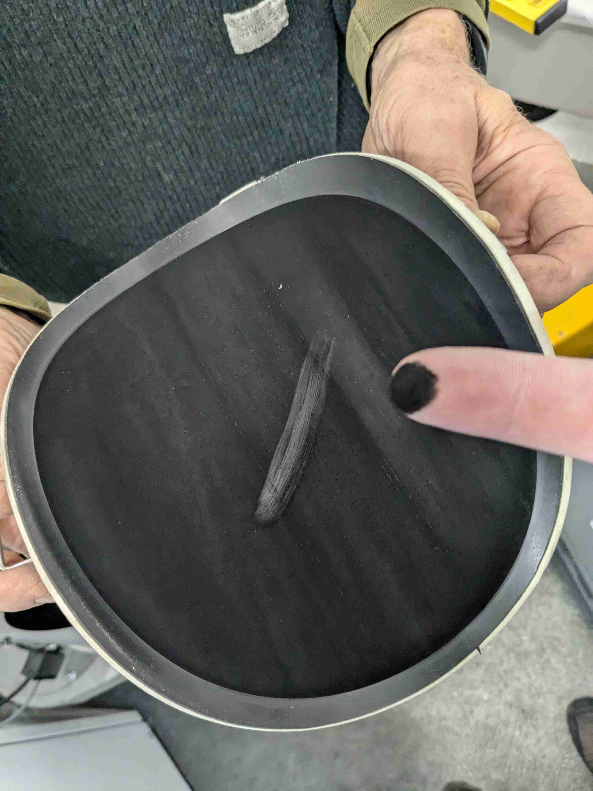

# Asche und Rauch
## Modulation 30%
Nach etwa einer Woche auf nonstop 30% Modulation beobachte ich:
- Die Brennertüre ist innen tief schwarz
- Im Kamin (Kamin-Revisionstürchen) ist feiner, schwarzer Staub
- Es stinkt angebrannt
- Auf dem Brennteller sind viele Krümel. Die scheinen fest dort zu sitzen. Lassen sich mit den Fingern einfach und fein verreiben.

Mir scheint die Verbrennung auf 30% sei nicht optimal.
Das ist ärgerlich, wollte ich die Brenner doch oft und über lange Zeit auf minimaler Modulation laufen lassen.

## Modulation 100%
Nach etwa einer Woche mit etwa der hälfte der Zeit auf 100% Modulation (dazwischen aus) beobachte ich:
- Die Brennertüre hat einen darüberliegenden, helleren Belag
- Es stinkt nicht so
- Der Brennteller ist weniger belegt.
- Dia Asche ist heller, fast grau.

Wäre spannend zu wissen wie die Abgaswerte bei verschiedener Modulation ist. Die Frage ist: soll ich auf 100% modulieren, vermutlich sauberer verbrennen dafür mehr Brenner-Starts verursachen oder lieber 30% modulieren, schlechter verbrennen dafür weniger Brenner-Starts verursachen. 