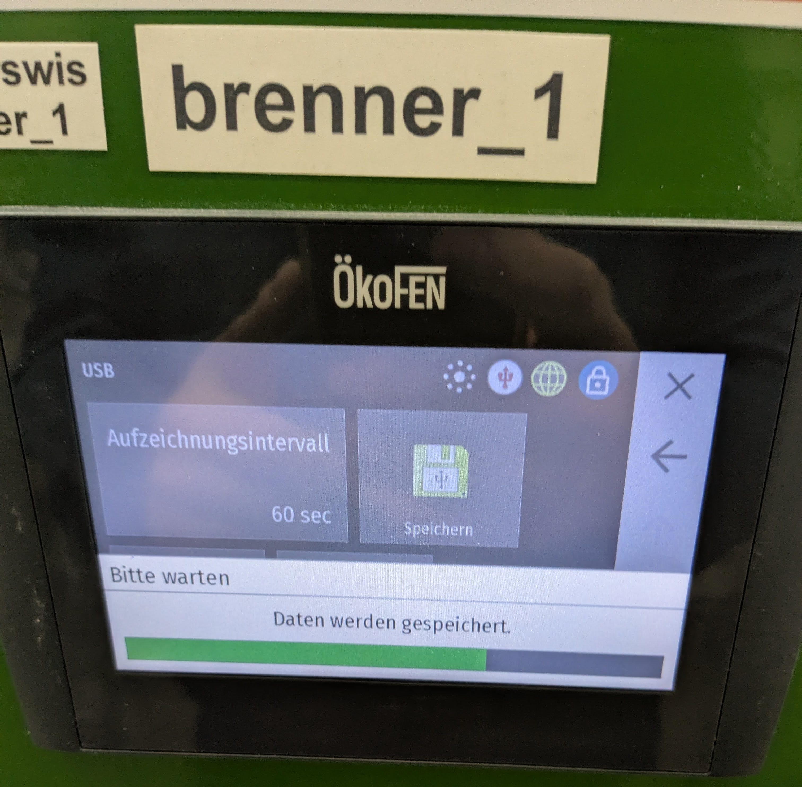
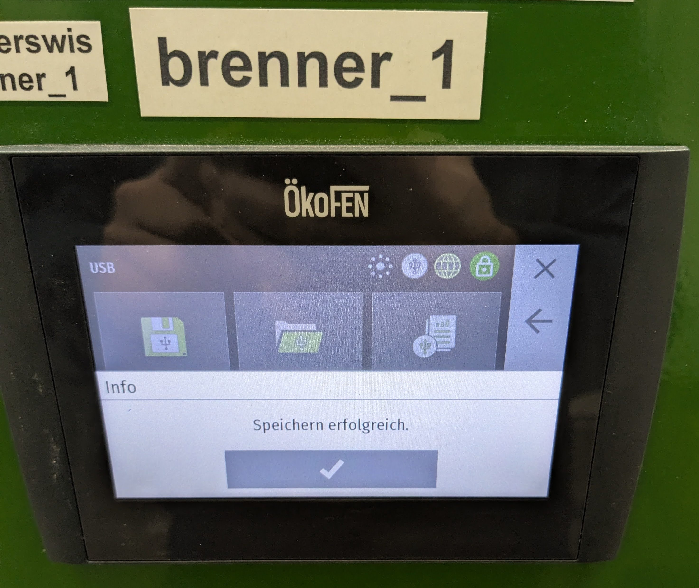
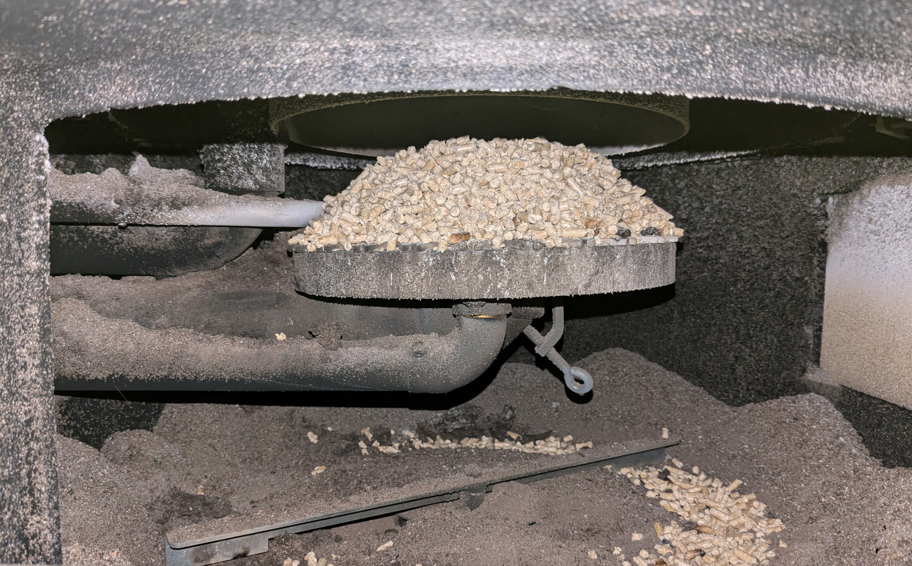

# Backup der Einstellungen

Die Software birgt viele Überraschungen!

Touch V.4.04

Ich versuche die Einstellungen der Brenner auf einem USB Stick abzuspeichern. Sollte doch nicht so schwierig sein, oder...

- Eigentlich würde ich das gerne vom Webinterface her machen aber diese Möglichkeit gibt es nicht.
- Gemäss Anleitung soll ich einen USB Stick im Touch einstecken. Mühsam: hierzu muss ich die Abdeckung öffnen: Schrauben lösen usw. 
- Es gibt zwei Steckplätze für USB. Welchen: steht nicht in der Anleitung. Ich nehme den ersten.
- Ich stecke den Stick ein. Klicke mich durch die Menus. Speichern: das tönt gut.

 
Nach einer gefühlten Ewigkeit sehe ich die Meldung: "Speichern erfolgreich". War gar nicht so schwierig.

- Ich laufen nach Hause und stecke den USB Stick in meinem PC. Leer. Kein einziges File.

Ich mache weitere Versuche: 
- verschiedene USB Sticks, einmal beim einen Steckplatz einmal beim anderen. Immer wieder. Es vergehen Stunden. Zum Glück kann ich in der Heizzentrale lautstark fluchen und es hört mich niemand.
- Ich finde einen Stick mit welchem es funktioniert. Steinalt und kleine Speicherkapazität.
- Ich bestelle zwei Sticks vom Typ USB-Stick Cruzer Blade 16GB SanDisk. Damit klappt es auch.

Während der gefühlten Ewigkeit, welche es braucht um die Einstellungen abzuspeichern, fällt mir etwas auf: Der brenner_2, der eigentlich gar nicht brennt, macht Geräusche. Immer wieder. Ich schaue rein: 

Jedes mal wenn ich versuche ein Backup abzuspeichern beginnt brenner_2 Pellets auf den Brennteller zu fördern. Was hat das mit dem Backup zu tun?

Brenner_2 dürfte sowieso nicht brennen: er ist gesperrt.

Liebe Software Entwickler: falls ihr das lest... es besteht viel Potential nach oben: nutzt es.

