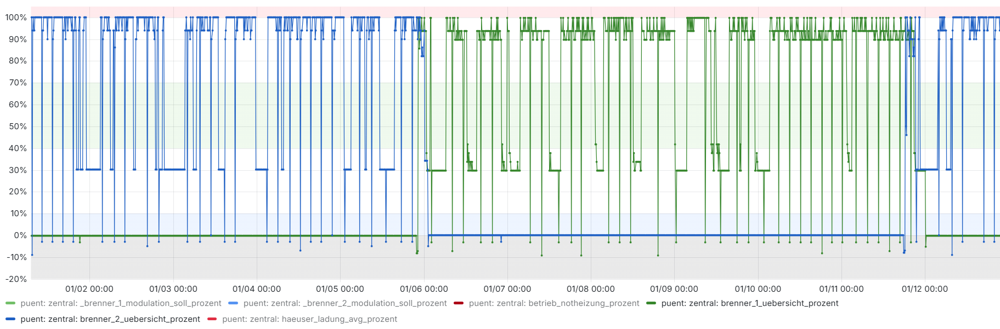
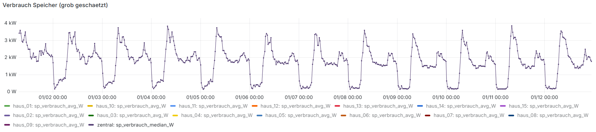
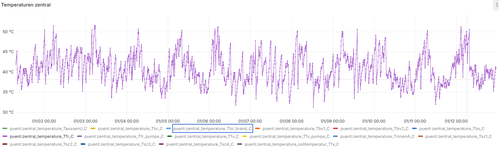
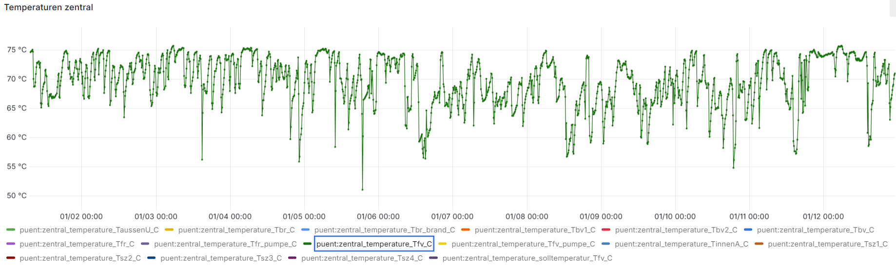
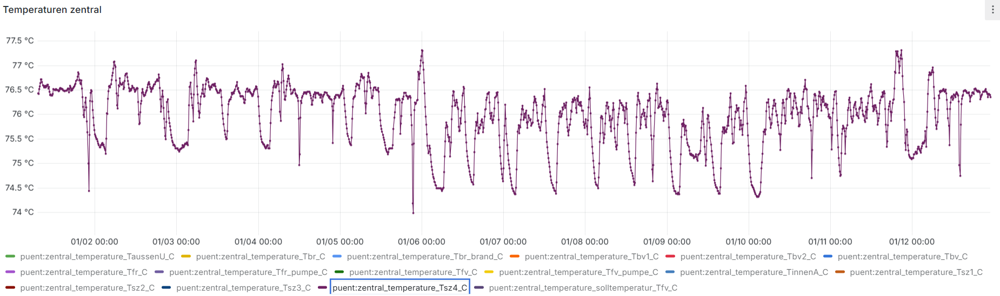
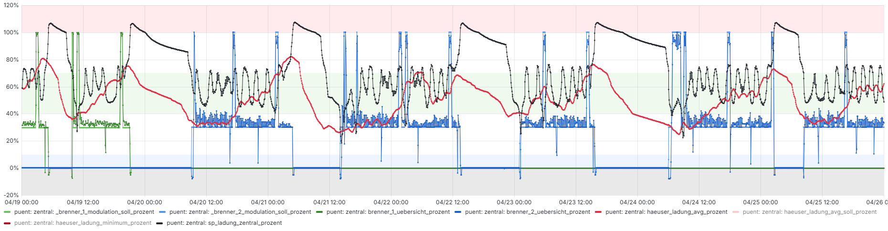
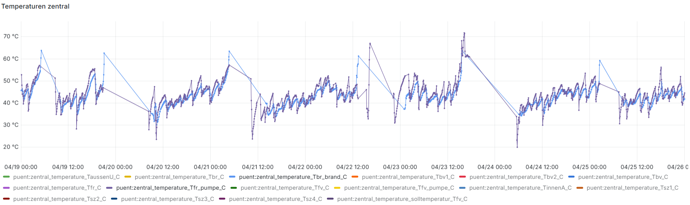

# Mode Automatik

## Zwischenstand Januar 2025

Hier ein Beispiel puent, Zeitbereich from=1735711767955&to=1736718791175.

Deutlich weniger Brennerstarts als beim "Manuellen" Betrieb.
Ruhig und stabil.

Brenner

- grüne Linie: brenner_1, blaue Linie: brenner_2
- Die Brenner modulieren entweder auf 100% oder 30%
- Geht die Linie auf -3%, so bedeutet das "saugen": Pellets werden in den Tagesbehälter gesogen.
- Die ersten 5 Tage brennt brenner_2 nonstop durch.
- Am 6. Januar muss der brenner_1 zugeschaltet werden. brenner_2 wird kurz darauf gelöscht weil es in der Nacht zu viel Energie hatte (brennen die Brenner auf "30%", so leisten sie je 20kW, also total 40kW, 50% der Nominalleistung)
- Am 12. Januar wird brenner_2 zugeschaltet und brenner_1 wird bald darauf gelöscht

Über 12 Tage musste zwei mal ein Brenner gezündet werden. Das ist super. Der Tagesbehälter wird regelmässig und rechtzeitig gefüllt. Je nach Bedarf der Siedlung wird sporadisch ein zweiter Brenner zugeschaltet. 

- Geschätzer Verbrauch eines Hauses (Median aller Häuser).
- Morgens um 8 Uhr Peak von ca. 3.5 kW. In der Nacht rund 250 Watt.
- Aufgrund dieser Messung mache ich eine Prognose und lade die dezentralen Speicher entsprechend. Der Morgentliche Peak könnte ohne Vorladen nicht oder nur durch zuschalten des zweiten Brenners bewältigt werden.

Fernleitung Rücklauftemperatur

- Die Rücklauftemperatur aus der Siedlung ist im Mittel etwa auf 42C. 
- Die Rücklauftemperatur entspricht fast exakt der Vorlauftemperatur der Brenner.
- Dieser Temperatur sollte so tief wie möglich sein. Tiefer als 35C wären gut. 

Probleme welche zu einer hohen Rücklauftemperatur führen:
- Brenner lassen sich nicht genügend Tief modulieren, ich muss in der Nacht die Siedlung dadurch zu viel füllen.
- Ich kann nur entweder auf 100% oder 30% modulieren. Zwischenwerde kriege ich nicht hin.
- Schlechte Eigenschaften der dezentralen Speicher, Durchmischung wegen den Registern, ungünstige Position der Register.
- Die Reserve in der Siedlung muss höher sein weil in der kalten Jahreszeit mehr Lastpeaks auftreten und ich dieses sonst nicht abfangen kann. Das Zünden eines Brenners braucht bis zu 50 Minuten. Entsprechend muss ich Reserve haben.

Fernleitung Vorlauftemperatur

- Die Vorlauftemperatur der Fernleitung Tfv wähle ich entpsrechend der Temperatur der dezentralen Speicher welche gerade geladen werden und anhand der Leistung welche ich von den brennern weg bringen muss.
- Durch diese variable Vorlauftemperatur kann ich die Ferluste in der Fernleitung reduzieren und ich kann eine tiefere Rücklauftemperatur erreichen.

Temperatur oben im zentralen Pufferspeicher

- Die Temperatur oben im zentralen Pufferspeicher ist bei ca. 75C. Tip top.

## Zwischenstand April 2025

Hier ein Beispiel puent, Zeitbereich from=1745013600000&to=1745618400000.

Brenner

- grüne Linie: brenner_1, blaue Linie: brenner_2
- Die Brenner modulieren entweder auf 100% oder 30%
- Etwa ein Brennerstart pro Tag
- Nach einem Tag wird von brenner_1 auf brenner_2 gewechselt. Dies weil die totale Laufzeit von brenner_2 rund 250h kleiner war als jene von brenner_1. Durch den Wechel verhindern wir eine grosse Asymmetrie in den Pelletbunkern.
- Mindestens alle 8h auf 30% wird die Modulation auf 100% angehoben um Ablagerungen auf dem Brennteller zu reduzieren.
- schwarze Linie: Ladestand zentraler Speicher.
- rote Linie: mittlere Ladung der Speicher in der Siedlung.

- violette Linie: Trf (Rücklauftemperatur von der Siedlung)
- hellblaue Linie: Tbr (Rücklauftemperatur in den Brenner)
- Die beiden Temperaturen sind ziemlich identisch, soll so sein.
- Die mittlere Rücklauftemperatur ist im Bereich 45 C.
- Je höher die dezentralen Speicher geladen werden desto höher die Rücklauftemperatur. Könnte ich tiefer modulieren, so könnte ich die Energie in den dezentralen Speichern minimal lassen. Die Rücklauftemperatur wäre vermutlich etwas 38 C und es gäbe keine Brennzyklen beim aktuellen Bedarf.