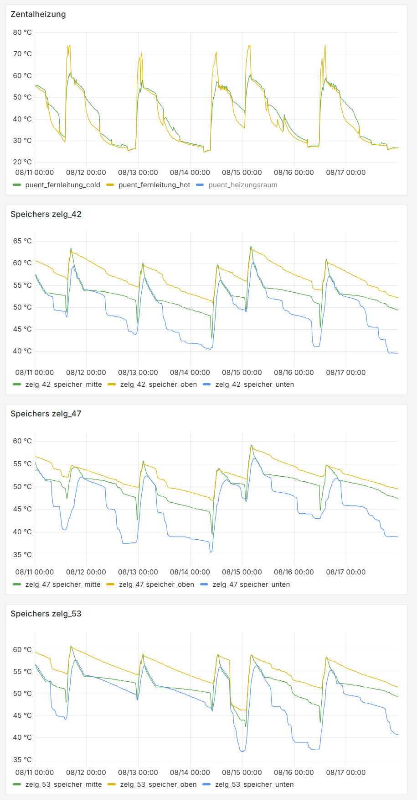
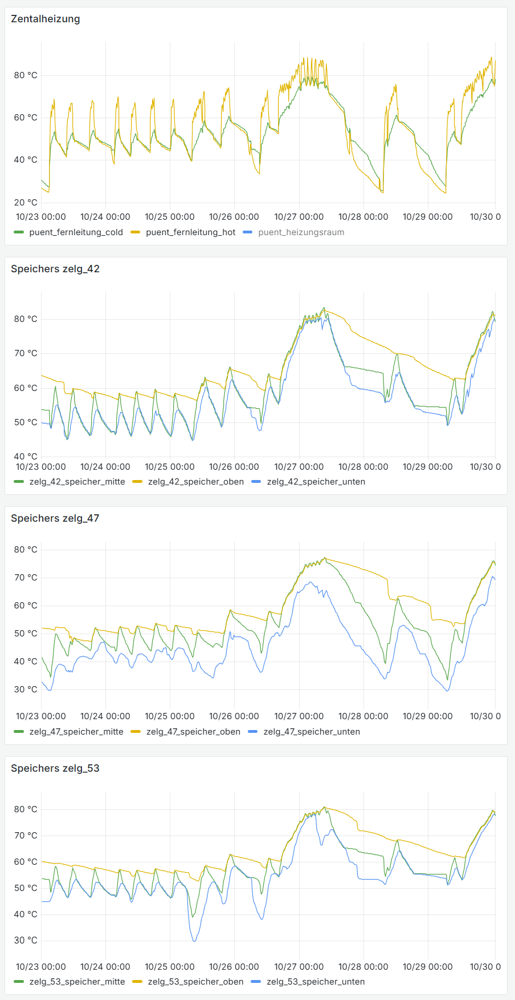
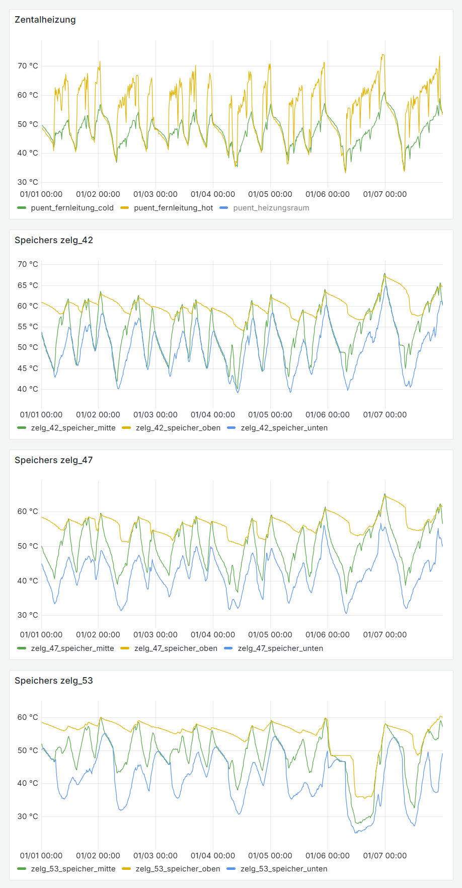

# Betrieb vor 2024, vor dem Umbau

Ich habe Messwerte gesammelt von Juli 2023 bis August 2024. Temperatursensoren an einigen dezentralen Speicherung und an der Fernleitung.

Eine wichtige Grösse sind die Brennzyklen. Jedes Zünden und Löschen eines Brenners verursacht Rauch und Verluste.

Anhand der nachfolgenden Beispiele habe ich die Brennzyklen abgeschätzt.

 Jahreszeit             |Sommer  |Herbst  |Winter
------------------------|--------|--------|--------
Brennzyklen pro Tag     |0.7     |3       |2

## Beispiel Sommer

Puent 2023-08-11 bis 2023-08-18
 - 5 Brennzyklen: 0.7 Brennzyklus pro Tag

## Beispiel Herbst

Die Heizung läuft nicht gut. Zeitenweise sehr heiss und Dauerbrand. Das Zählen ist schwierig.

Puent 2023-10-23 bis 2023-10-30
 - Etwa 21 Brennzyklen: 3 Brennzyklus pro Tag
 

## Beispiel Winter

Bei Dauerbrand machte die alte Heizung alle 4 Stunden eine "Entaschung". Dies ist als Einbruch der Fernleitung_hot zu erkennen. Es ist kein Brennerstart, rauchte aber dennoch mehr.

Puent 2024-01-01 bis 2024-01-07
 - Etwa 15 Brennzyklen: 2 Brennzyklus pro Tag
 

