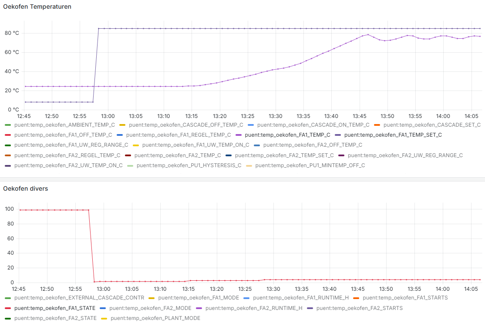

# Brenner Startzeit
## Brenner kalt
Puent
12:57 Anforderung an PE1, FA1_TEMP_C ist 24.7C
13:47 PE1 ist warm, die UW Pumpe beginnt zu pumpen.

Vom Moment der Anforderung bis die Pumpe UW anläuft sind 50 Minuten vergangen. Das ist lang.

http://maerki.com:3000/d/da82d5b6-3fd8-4534-80e5-da1155c11310/uebersicht?orgId=1&var-etappe=puent&var-haus=All&var-reihe=All&var-unten_mitte_oben=All&var-LadungDezentral=individuell&var-verbrauch=sp_verbrauch_avg_W&from=1729853072076&to=1729858014374

## Brenner bereits warm

Wenn der Brenner bereits warm ist geht es deutlich schneller. z.B. 15 Minuten.

