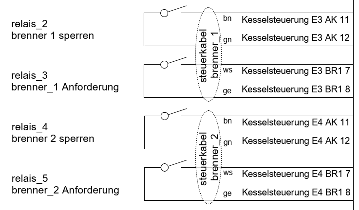

# Modbus 
Als Kunde kann ich per Modbus RTU mit dem Oekofen Touch kommunizieren.
Innen an der Brennerabdeckung, an der Rückwand vom Touch gibt es einen Anschluss. 

Den passenden Stecker habe ich selber organisiert:
Wuert WR-TBL Series 3043 - 3.81 mm Artikel 691304300004

Die Pinbelegung und Steckertyp sind von Oekofen nicht dokumentiert.
Die Beschriftung von Oekofen, A und B, ist schlecht. Korrekt wären D+ und D-.
(A und B werden je nach Hersteller verschieden gebraucht.  Details unter: https://en.wikipedia.org/wiki/RS-485) 

Ich habe die Belegung durch ausprobieren gefunden, siehe Beschriftung auf Bild.

- Baudrate, fix: 19200 baud.
- Adresse, fix: 1
- Oekofen Touch ist Slave.
- Kommunikation gemäss 20240826a_Modbus_Kaskade_2.05.pdf, nicht wählbar (weil ich eine Kaskade habe).
- Wenn ich Werte schreibe, so wird das Flash abgenutzt. Vermutlich sind ca. 100k Schreibzyklen möglich. Hier deutet ein Satz im Dokument 20240826a_Modbus_Kaskade_2.05.pdf hin: "Important Note: Write cycles under 2h will reduce the life time of the internal flash memory."

Diese Limitierung ist sehr unschön. Wenn ich per Modbus etwas schreibe, so soll das doch nicht permanent gespeichert werden (und schon gar nicht das Flash abnützen.)

Mit diesem Interface bin ich sehr unzufrieden.

# Relais Eingänge
In jedem Brenner ist eine "Kesselsteuerung". Hier kann ich mit einem Relaiskontaken einwirken.

Meine Beschaltung

Ich kann den Brenner zum Brennen zwingen wenn ich BR schliesse. Ich kann den Brenner sperren wenn ich AK schliesse.
Jeden einzeln.

Ich bin sehr froh, die Brenner so steuern zu können.

Ich habe beobachtet: Wenn ich die Anlage Ausschalte am Touch, Betriebsart Aus, also etwas das was jeder Kaminfeger macht.

Und der Pufferspeicher auch keine Wärme braucht: PE1 Anforderung Aus.

Jedoch der Kontakt BR von Kessel 1 geschlossen ist, so brennt der Brenner 1.
Das Verhalten finde ich schon sehr fragwürdig!

Das Brennen verhindern, falls BR geschlossen ist, kann man mit dem Touch nur, indem man jeden einzelnen Brenner Sperrt. Üble Sache!

Auf dem Touch werden Symbole angezeigt, je nach Relaiskontakt. Das ist hilfreich zu wissen (da nicht in Doku Oekofen).
