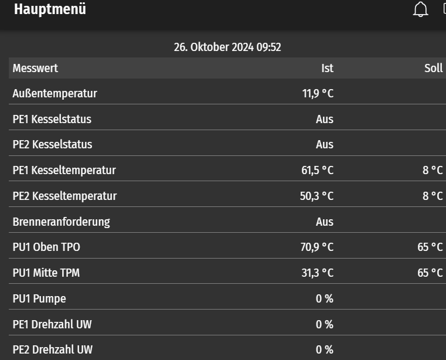
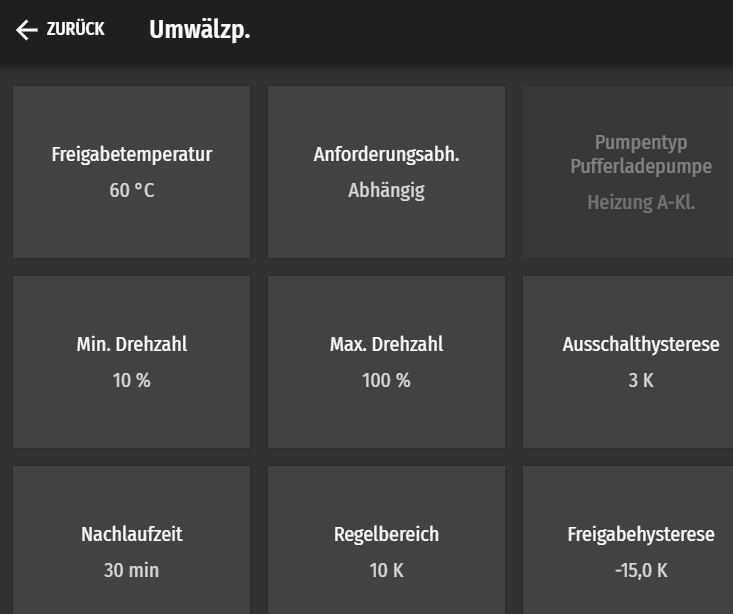
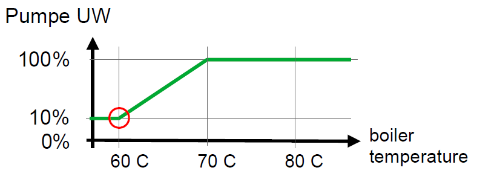
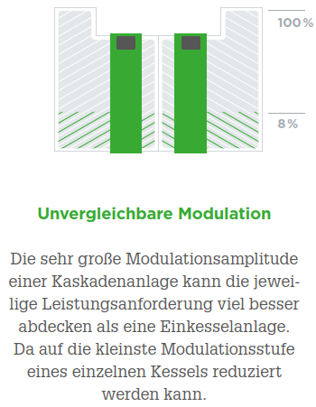
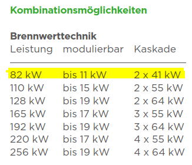

# Modulation der Brenner
Mit Touch V.4.04

Ich verstehe vieles nicht wirklich. Auch bei Xten mal durchlesen der Unterlagen verstehe ich das Konzept nicht richtig. Unterschiedliche Bezeichnungen für dieselben Sachen helfen auch nicht weiter. Was ich hier wieder gebe, ist nach bestem Wissen und Gewissen und durch Ausprobieren ermittelt worden.

Was ich meine zu verstehen:

Menu Hauptmenu: unten angezeigte Werte in Touch.
Eine wichtige Grösse ist die Kesseltemperatur. Siehe Bild z.B. "PE1 Kesseltemperatur".
- "Ist" ist der gemessene Wert, "Soll" ist der Sollwert. 

Der Sollwert hängt von vielem ab. Mit vielem meine ich, es ist eine Verknüpfgung von diversen Grössen. Die Verknüpfung ist in den Unterlagen nicht klar beschrieben und ich habe sie auch im Detail nicht verstanden. Auf die in Soll angezeigte Temperatur wird auf jeden fall mit der Modulation geregelt.

In meinem Fall habe ich es so hin gekriegt, dass bei "Soll"  jene Temperatur erscheint, welche ich im Menu Pellematic 1, Einstellung, "Regeltemperatur" einstelle. (Modbus Reg 22 temp set)

"PE1 Kesseltemperatur Ist" wird mit der Modulation auf "PE1 Kesseltemperatur Soll" geregelt. PID Regler, Parameter mir unbekannt. 

Was auch immer da Regelt, es scheint mir etwas fragwürdig. Ich habe mich viel mit Regelungstechnik befasst. Was ich da so sehe deutet nicht auf eine robuste Sache hin.
Ein kleines Beispiel: Alles läuft stabil, jetzt saugt der Brenner für 2 Minuten. Es geht weiter mit einer völlig anderen Modulation. Integralanteil einfach mal so gelöscht?
# Umwälzpumpe

Die Umwälzpumpe UW fördert das Wasser vom Kessel zum Speicher. 

Menu Pellematic 1, Umwälzpumpe

Wie ich das verstehe:

Beispiel: Modulation 100%:
- Bei mir habe ich im Rücklauf typischerweise Wasser von 40C
- PE1 Kesseltemperatur Soll 85 C
- UW Freigabetemperatur 74 C

Es stellt sich ein:
- "PE1 Kesseltemperatur Ist" 75.5C.
- UW Pumpe läuft auf 23%
- Modulation 100%

Die "PE1 Kesseltemperatur Soll" von 85 C wird nicht erreicht, daher Modulation 100%. 
Aufgrund der Vorlauftemperatur von 40C und der Einstellung der Umwälzpumpe ergibt sich die Kesseltemperatur.

Beispiel: Modulation 30%:
- Bei mir habe ich im Rücklauf typischerweise Wasser von 40C
- PE1 Kesseltemperatur Soll 65 C
- UW Freigabetemperatur 74 C

Es stellt sich ein:
- "PE1 Kesseltemperatur Ist" 74.7C.
- UW Pumpe läuft auf 13%
- Modulation 30%

Die "PE1 Kesseltemperatur Soll" von 65 C wird immer überschritten, daher Modulation minimal 30%. 
Aufgrund der Vorlauftemperatur von 40C und der Einstellung der Umwälzpumpe ergibt sich die Kesseltemperatur.

Die Einstellungen können so gewählt werden, dass eine ändernde Rücklauftemperatur Einfluss auf die Modulation hat. Es mag Systeme geben wo das durchaus Sinn macht. In meinem Fall, mit fixen 40C im Rücklauf spielt die Modulation nicht, sie ist fix.
Und wenn ich die Modulation kleiner als 100% einstelle, so reicht es im Winter nicht.

Ich finde keine Einstellung, welche die Modulation auf einen stabilen Wert zwischen 30% und 100% regelt. 

Mein Dilemma:

Ich kenne die Last (unsere Häuser) und die Erzeuger (Brenner). Ich möchte die Brenner so steuern, dass ich so viel Leistung kriege wie die Last aktuell braucht.
Mit Modbus kann ich z.B. die "PE1 Kesseltemperatur Soll" einstellen. Also z.B. PE1 auf 75% Modulation. 75% kann ich jedoch nicht stabil einstellen. Ich müsste die Kessel Solltemperatur immer wieder schreiben und so die 75% Modulation erzwingen. Immer wieder schreiben geht aber nicht weil ich damit das Flash abnütze. Achje.

Was mir bleibt: ich kann zwischen 30% und 100% Modulation hin und her schalten. Wenn ich das nicht zu oft mache...

In den Verkaufsunterlagen finde ich Sätze wie "Ist der Bedarf hoch, ruft sie ihre maximale Leistung ab. Ist er niedrig, passt sich die Leistung
entsprechend bis zu 30% der Nennleistung an." 

In meinem Fall stimmt das aus meiner Sicht nicht.
Sehr gerne hätte ich, dass sich die Heizleistung automatisch dem Bedarf anpasst. Am liebsten durch eine clevere Speicher-Bewirtschaftung oder indem dass ich als Benutzer die Möglichkeit habe die Modulation selber vor zu geben. Beides geht nicht.

So, das war mein Frust.

Auch wenn das Versprechen im Prospekt wohl etwas zu hoch ist...ich kann ein oder zwei Brenner brennen lassen. Jeweils auf 30 oder 100%. Das ist gut, viel besser als mit nur einem Brenner. Jedoch mit einem sehr grossen Aufwand. Der durchschnittliche Anwender wird das nicht machen.

Liege ich falsch mit meinen Aussagen? Ich lerne gerne dazu, nehme Tipps gerne entgegen.