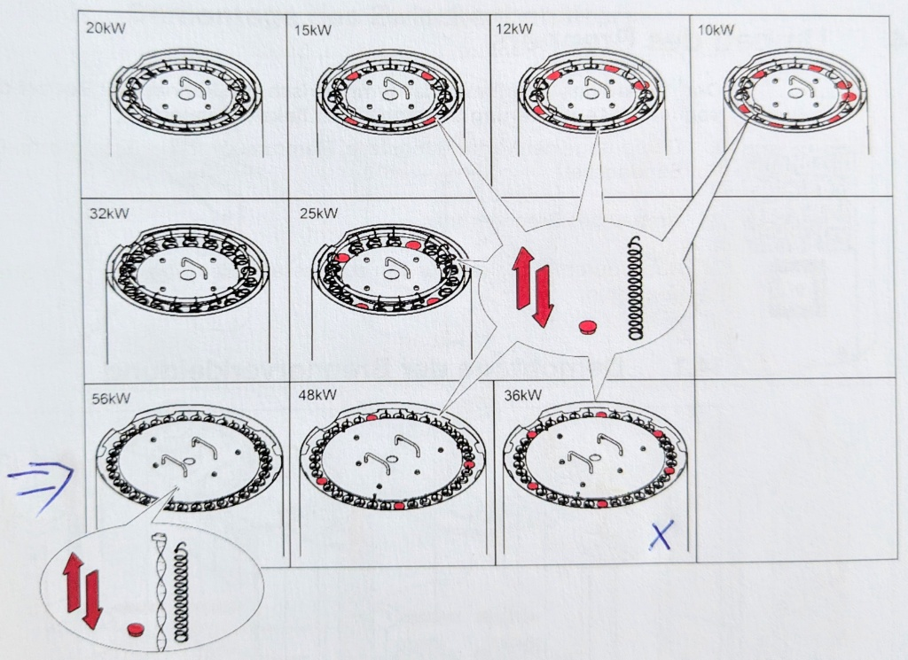
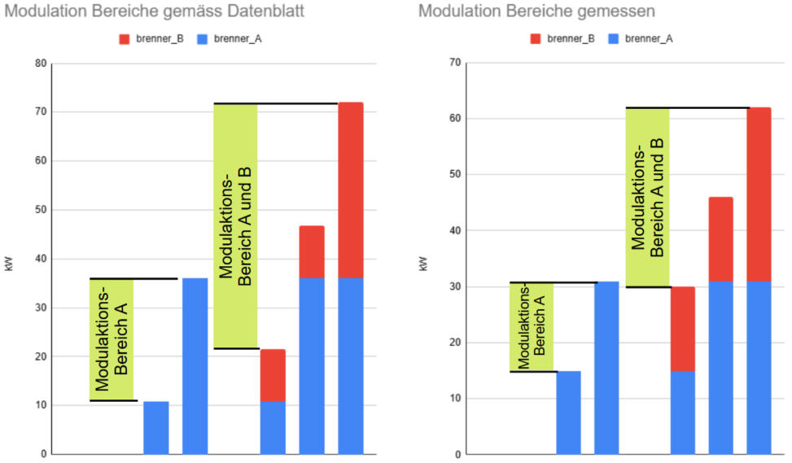

# Modulation der Brenner
Mit Touch V.4.04

Ich verstehe vieles nicht wirklich. Auch bei Xten mal durchlesen der Unterlagen verstehe ich das Konzept nicht richtig. Unterschiedliche Bezeichnungen für dieselben Sachen helfen auch nicht weiter. Was ich hier wieder gebe, ist nach bestem Wissen und Gewissen und durch Ausprobieren ermittelt worden.

Was ich meine zu verstehen:

Menu Hauptmenu: unten angezeigte Werte in Touch.
Eine wichtige Grösse ist die Kesseltemperatur. Siehe Bild z.B. "PE1 Kesseltemperatur".
- "Ist" ist der gemessene Wert, "Soll" ist der Sollwert. 

Der Sollwert hängt von vielem ab. Mit vielem meine ich, es ist eine Verknüpfgung von diversen Grössen. Die Verknüpfung ist in den Unterlagen nicht klar beschrieben und ich habe sie auch im Detail nicht verstanden. Auf die in Soll angezeigte Temperatur wird auf jeden Fall mit der Modulation geregelt.

In meinem Fall habe ich es so hin gekriegt, dass bei "Soll"  jene Temperatur erscheint, welche ich im Menu Pellematic 1, Einstellung, "Regeltemperatur" einstelle. (Modbus Reg 22 temp set)

"PE1 Kesseltemperatur Ist" wird mit der Modulation auf "PE1 Kesseltemperatur Soll" geregelt. PID Regler, Parameter sind mir unbekannt. 

Was auch immer da Regelt, es scheint mir etwas fragwürdig. Ich habe mich viel mit Regelungstechnik befasst. Was ich da so sehe deutet nicht auf eine robuste Sache hin.
Ein kleines Beispiel: Alles läuft stabil, jetzt saugt der Brenner für 2 Minuten. Es geht weiter mit einer völlig anderen Modulation. Integralanteil einfach mal so gelöscht?
# Umwälzpumpe

Die Umwälzpumpe UW fördert das Wasser vom Kessel zum Speicher. 

Menu Pellematic 1, Umwälzpumpe

Wie ich das verstehe:

Dies aber nur wenn die Freigabehysterese stark negativ ist. 

Beispiel: Modulation 100%:
- Bei mir habe ich im Rücklauf typischerweise Wasser von 40C
- PE1 Kesseltemperatur Soll 85 C
- UW Freigabetemperatur 74 C (roter Kreis in obiger Grafik, nicht bei 60 sondern bei 74 C)

Es stellt sich ein:
- "PE1 Kesseltemperatur Ist" 75.5C.
- UW Pumpe läuft auf 23%
- Modulation 100%

Die "PE1 Kesseltemperatur Soll" von 85 C wird nicht erreicht, daher Modulation 100%. 
Aufgrund der Vorlauftemperatur von 40C und der Einstellung der Umwälzpumpe ergibt sich die Kesseltemperatur.

Beispiel: Modulation 30%:
- Bei mir habe ich im Rücklauf typischerweise Wasser von 40C
- PE1 Kesseltemperatur Soll 65 C
- UW Freigabetemperatur 74 C

Es stellt sich ein:
- "PE1 Kesseltemperatur Ist" 74.7C.
- UW Pumpe läuft auf 13%
- Modulation 30%

Die "PE1 Kesseltemperatur Soll" von 65 C wird immer überschritten, daher Modulation minimal 30%. 
Aufgrund der Vorlauftemperatur von 40C und der Einstellung der Umwälzpumpe ergibt sich die Kesseltemperatur.

Die Einstellungen können so gewählt werden, dass eine ändernde Rücklauftemperatur Einfluss auf die Modulation hat. Es mag Systeme geben wo das durchaus Sinn macht. In meinem Fall, mit fixen 40C im Rücklauf spielt die Modulation nicht, sie ist fix.
Und wenn ich die Modulation kleiner als 100% einstelle, so reicht es im Winter nicht.

Ich finde keine Einstellung, welche die Modulation auf einen stabilen Wert zwischen 30% und 100% regelt. 

Mein Dilemma:

Ich kenne die Last (unsere Häuser) und die Erzeuger (Brenner). Ich möchte die Brenner so steuern, dass ich so viel Leistung kriege wie die Last aktuell braucht.
Mit Modbus kann ich z.B. die "PE1 Kesseltemperatur Soll" einstellen. Also z.B. PE1 auf 75% Modulation. 75% kann ich jedoch nicht stabil einstellen. Ich müsste die Kessel Solltemperatur immer wieder schreiben und so die 75% Modulation erzwingen. Immer wieder schreiben geht aber nicht weil ich damit das Flash abnütze. Achje.

Was mir bleibt: ich kann zwischen 30% und 100% Modulation hin und her schalten. Wenn ich das nicht zu oft mache...

In den Verkaufsunterlagen finde ich Sätze wie "Ist der Bedarf hoch, ruft sie ihre maximale Leistung ab. Ist er niedrig, passt sich die Leistung entsprechend bis zu 30% der Nennleistung an." 

In meinem Fall stimmt das aus meiner Sicht nicht. Kessel zu und weg schalten vermutlich ja, modulieren nein. Ein reduzieren der Brennleistung erfolgt allenfalls dann, wenn der Rücklauf zu den Brennern heiss wird. Das kann gemacht werden. Dann sind die Speicher aber bereits voll und der Wirkungsgrad ist deshalb bereits schlecht. 

Sehr gerne hätte ich, dass sich die Heizleistung automatisch dem Bedarf anpasst. Am liebsten durch eine clevere Speicher-Bewirtschaftung oder indem dass ich als Benutzer die Möglichkeit habe, die Modulation selber vor zu geben. Beides geht nicht.

So, das war mein Frust.

Auch wenn das Versprechen im Prospekt wohl etwas zu hoch ist...ich kann ein oder zwei Brenner brennen lassen. Jeweils auf 30 oder 100%. Das ist gut, viel besser als mit nur einem Brenner. Jedoch mit einem sehr grossen Aufwand. Der durchschnittliche Anwender wird das nicht machen.

# Leistung Messung

Ich habe die Leistung der Brenner gemessen. Dies mache ich indem ich über eine Zeitspanne, in welcher ein Brenner mit konstanter Modulationsstufe brennt (also 30% oder 100%), die Energie messe welche durch das Mischventil geflossen ist. Die Energie von den Brennern muss durch das Mischventil in die dezentralen Speicher. Ich wähle eine Zeitspanne bei welcher der Ladestand des zentralen Speichers zu Beginn und am Ende etwa gleich gross ist. Der Speicher sollte dadurch das Resultat nicht verfälschen.
Energiezähler: Mischventil: EV025R3+BAC von Belimo. Die Toleranz dieses Energiezählers liegt bei einigen Prozent. Die Wärmeverluste im zentralen Speicher und den Leitungen in der Heizzentrale sind verglichen mit der Brennerleistung vermutlich vernachlässigbar.
Ich messen mehrmals, mit der einen Heizzentrale und mit der anderen, mit jeweils einem der 4 Brenner. Die Resultate sind recht konsistent.

## Nennlistung
Wir haben Brenner vom Typ PESK41 mit 6 verschlossenen Wirbulatoren.
Aus den Datenblättern werde ich nicht ganz schlau.

Eingestellt ist Leistungsstufe 36.
Ich erwarte also 36 kW Nutzleistung bei 100% Modulation und 12 kW bei 30% Modulation.

###  Messung

|Modulation angezeigt %|gemäss Datenblatt kW|gemessen  kW|
|--------|--------|---------|
|100     |36       |31|
|30    |12       |15|

Ich messe 31 kW bei 100% Modulation. Das ist etwas zu wenig.
Wenn ich auf 30% moduliere (Oekofen touch zeigt sauber 30%), so messe ich 15 kW. Das ist klar zu viel.
Das entspricht 48 % der gemessenen Maximalleistung.

Der Modulationsbereich ist deutlich kleiner als erwartet und weicht stark von den Angaben im Hochglanzprospekt ab.

Die Modulationsbereiche überlappen nicht: Grüne Bereiche in der folgenden Darstellung.

Mögliche Fehlerquellen meiner Messung
- Verluste in der Heizzentrale. Diese würden jedoch nich dazu führen, dass ich eine zu kleine Modulation messe.
- Energiezähler. Die Fehler sind vermutlich klein im Vergleich zu den gemessenen Abweichungen.
- Russ im Brenner. Abgelagerter Russ reduziert die Brennerleistung. Nach dem Kaminfeger allenfalls wieder grössere Leistung. Die Modulation sollte das jedoch nicht beeinflussen ... ?
- Der von Oekofen angezeigte Modulationsgrad ist nicht konstant bei 100% oder 30%. Er schwankt manchmal, also von 100% auf 94% oder von 30% auf 34%. 
- Die Rücklauftemperatur von den dezentralen Speichern hat einen Einfluss auf den Wirkungsgrad der Brenner. Wohl aber nicht so viel.

Ich vermute: Die Einstellung einer tiefen Leistungsstufe limitiert die maximale Leistung in der Software. Die minimale Leistung bleibt, weil siedurch die Physik vom Brenner gegeben ist. Dadurch wird die Modulationsbreite kleiner.

Aber warum wird dann eine Modulation von 30% und 100% angezeigt? 

Korrekterweise wären es in meinem Fall:
- maximal 100% und minimal 48%, falls sich das 100% auf die aktuelle, limitierte Leistung bezieht.
- oder maximal 62% und minimal 30% falls sich die maximale Leistung auf die mögliche Leistung bezieht.

In unserer Anwendung führt das zu deutlich mehr Brennzyklen.
Beispiel: Die Siedlung benötigt im Schnitt 29 kW, so kann ich das nur mit einem einzelnen Brenner machen, mit zwei Brennern hätte ich zu viel Leistung (2*15kW = 30 kW). Braucht die Siedlung jedoch 31 kW, so kann ich das nur mit zwei Brennern machen.
Jetzt, wo ich diese Zeilen schreibe, mitte Dezember 2024, braucht die grössere der beiden Siedlungn gerade etwa 30 kW Leistung. Ich kriege das nur hin, wenn ich täglich den zweiten Brenner zünde und am Abend wieder lösche. Hätte ich einen Modulationsbereich gemäss Datenblatt, so könnte ich die ganze Zeit zwei Brenner problemlos durch laufen lassen und mit der Modulation die Leistung anpassen, von 22 bis 62 kW. Sehr schade!

Nachtrag Januar 2025:
Ich habe die Leistungsstufe auf 41 erhöht. Die Leitung per Software immer zu drosseln macht sicher keinen Sinn.
Ich kann nicht beide Brenner gleichzeitig auf Leistungsstufe 41 stellen. Was geht: den einen auf 41, den anderen auf 40.  Wenn ich jenen mit 40 auf 41 stelle, so springt der angezeigte wert im Touch nach einer Minute wieder auf 40. Wo ich auch rein schaue: gespickt mit Softwareböcken.

Ich messe: 

|Modulation angezeigt %|gemäss Datenblatt kW|gemessen  kW|
|--------|--------|---------|
|100     |41       |40|
|30    |12      |21|

Bei minimaler Modulation, angezeigt "30%" kriege ich 21 kW statt 12 kW. Über 50% Leistung bei "30%" Modulation!
So ein Frust. Ich gebe auf.

Liege ich falsch mit meinen Aussagen? Ich lerne gerne dazu, nehme Tipps gerne entgegen.