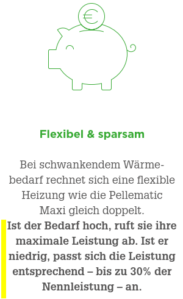
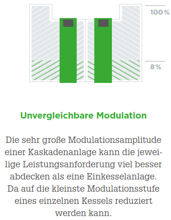
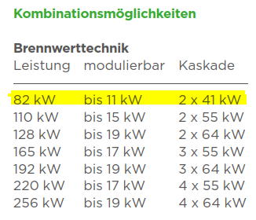
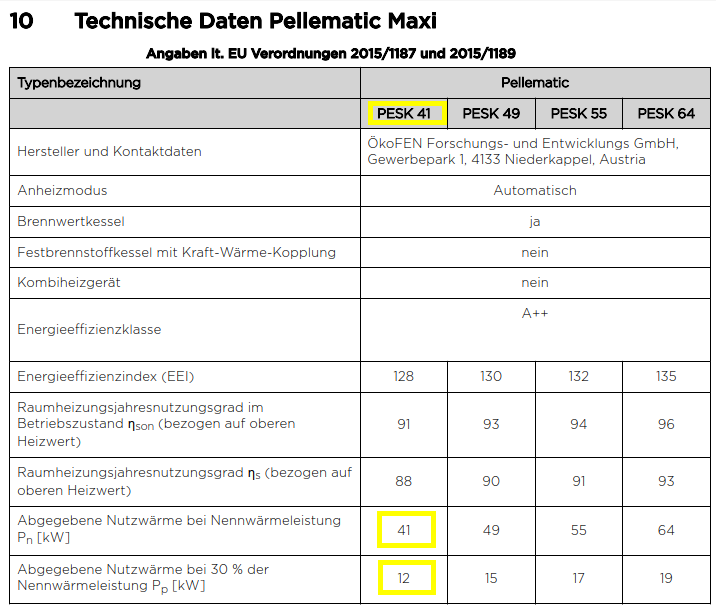

2025-01-19 Peter Märki 
2025-04-27 Peter Märki 
2025-07-27 Peter Märki

https://github.com/petermaerki/puenterswis_heizung_2023_git/blob/main/erfahrung_doku/offene_fragen/readme.md

# Offene Fragen im Januar 2025
## Unsere Anlage
Wir haben zwei Pellematic Maxi, Kaskade, zwei PESK41 mit 6 verschlossenen Wirbulatoren, mit Brennwert, Touch V.4.04, Nennleistung je Brenner: 41kW. 
## Was sagen die technischen Unterlagen
Als Kunde habe ich die mir zur Verfügung stehenden Unterlagen studiert. 
Unter anderem beeindruckten mich folgende Angaben:

Prospekt: OekoFEN_PF_AT_PellematicMaxi.pdf

"Ist der Bedarf hoch, ruft sie ihre maximale Leistung ab. Ist er niedrig, passt sich die Leistung entsprechend bis zu 30% der Nennleistung an."

 Super, das ist genau was ich möchte!

Planungsmappe: Planungsmappe_PESK_02_2023.pdf

PESK41, 11 bis 41 kW, entspricht Modulation 30% bis 100% - super, diese Brenner können modulieren!

Planungsmappe: Planungsmappe_PESK_02_2023.pdf

Tiefe Rücklauftemperatur - das kann ich bieten.
## Problem
Ich kriege nicht hin was mir die Unterlagen versprechen. 
Weder kriege ich die Oekofen Steuerung dazu, entsprechend dem Bedarf die Leistung geeignet zu variieren noch gelingt es mir mit meiner externen Steuerung über Modbus die Leistung auf 30 % zu modulieren. Bei einer "30%" angezeigten Modulation messe ich 21 kW Leistung - deutlich zu viel. Ich habe viele EMails geschrieben, diverse Telefonate geführt, viel diskutiert. Trotz hohem Zeitaufwand gelingt es mir nicht.

Argumente für eine Demonstration vor Ort:

- Ich lerne gerne dazu. 
- Von den versprochenen Eigenschaften würde ich gerne profitieren.
- Eine ideale Gelegenheit um als Brennerhersteller die angepriesenen Eigenschaften in einer realen Kundenanwendung zu demonstrieren.

## Wunsch 1, Demonstration ein Brenner auf 30% Modulation

Gerne möchte ich einen unserer Brenner auf 30 % Leistung brennen sehen. Vorgegeben über Modbus.
- Beide Brenner sind auf Leistungsstufe 41 eingestellt.
- Ich schliesse den Steuerkontakt BR eines Brenners: Anforderung: Dieser eine Brenner läuft nun auf 100%.
- Demonstration: Eine Fachperson steuert die Anlage über Modbus so, dass der Brenner die Leistung von 100% Modulation auf 30% Modulation reduziert.
- Der Brenner soll 24 Stunden auf 30% Modulation brennen. In dieser Zeit möchte ich die Leistung von 11 kW nachmessen. 
- Ich möchte vom zentralen Pufferspeicher Wasser mit einer Temperatur von 70C beziehen und Wasser mit einer Temperatur von 35C zurück liefern.
- Ich möchte sehen wie sauber die Verbrennung ist.

Die Resultate dieser Demo würde ich gerne an dieser Stelle dokumentieren:
- Befehlssequenz Modbus.
- Leistung über die Zeit.
- Fotos vom Brennraum, Fotos der Asche.
- Allenfalls, falls ich das organisieren kann: Feinstaubmessung durch unseren Kaminfeger.

### Notizen Besprechnung vom 2025-04-22
- Per Modbus könne die Modulation weder direkt noch indirekt vorgegeben werden. 
- Eine Verbrennung bei tiefer Modulation würde zu einer schlechteren Sekundärverbrennung und damit zu einer erhöhten CO Emission führen. Es sei besser den Brenner zu löschen und später wieder zu zünden als ihn lange Zeit bei tiefer Modulation zu betreiben. 
- Meine Messung, dass bei einer angezeigten Modulation von 30% eine Leistung von 21 kW erzeugt wird, scheint korrekt zu sein. (erwartet würde 30% von 41 kW = 12 kW)
- Eine Demonstration wie von mir gewünscht kann aus diesen Gründen momentan nicht erfolgen.

## Wunsch 2, Demonstration "automatische Bedarfsanpassung"

Gerne möchte ich die Anlage beobachten wie sie ihre Leistung automatisch an den Bedarf anpasst. 
- Beide Brenner sind auf Leistungsstufe 41 eingestellt.
- Demonstration: Die Anlage soll von eine Fachperson so eingestellt werden, dass die Leistung automatisch, durch Modulation sowie Zünden und Löschen an den Bedarf anpasst wird. 
- Keine Einwirkung meiner Steuerung auf die Brenner, ich zeichne nur auf was passiert.
- Ich werde über zwei Tage den Bedarf mit meiner Steuerung variieren. Hierzu werde ich vom Pufferspeicher variable Mengen von Wasser mit 70C entnehmen. Bezogene Leistung von 0 kW bis 82 kW.
- Die Rücklauftemperatur in den Pufferspeicher werde ich auf ca. 35C halten - gemäss den Anforderungen der Planungsmappe für einen effizienten Einsatz der Brennwerttechnik.

 
Gerne diskutiere ich anschliessend das Verhalten der Anlage mit einer Fachperson:

- Bezüglich dem Satz: "Ist der Bedarf hoch, ruft sie ihre maximale Leistung ab. Ist er niedrig, passt sich die Leistung entsprechend bis zu 30% der Nennleistung an."
z.B. möchte ich sehen, dass bei einem Bezug von 12kW ein Brenner dauernd auf 30% Modulation brennt.
- Zur gemessenen Rücklauftemperatur der Brenner (erwartet: ca. 35 °C).

Die Resultate dieser Demo würde ich gerne an dieser Stelle dokumentieren:
- Einstellparameter.
- Zeitverlauf von Leistungsbedarf, Modulation der Brenner, alle Temperaturen.

### Notizen Besprechnung vom 2025-04-22
- Die Modulation der Brennerleistung wird durch die Rücklauftemperatur beeinflusst. Steigt die Rücklauftemperatur, kann die Modulation abgesenkt werden. Ein heißer Rücklauf bedeutet, dass der Pufferspeicher bereits geladen ist – in diesem Zustand sinkt der Wirkungsgrad des Systems.
- Das Zünden und Löschen der Brenner erfolgt anhand der Speicherladung, basierend auf den Temperaturen TPO (oben) und TPM (Mitte).

Konsequenz: 
- Die Leistung (Modulation) wird nicht dynamisch an den Bedarf angepasst.
- Pufferspeicher: Wird viel Energie entnommen, werden Brenner gezündet; bei geringem Bedarf werden sie wieder abgeschaltet.
- Reicht der Bedarf nicht aus, kann die Modulation des letzten aktiven Brenners reduziert werden, bis auch dieser abgeschaltet wird. In diesem Zustand ist der Wirkungsgrad nicht optimal weil die Rücklauftemperatur hoch ist. 
Das ist Ungünstig für uns: bei unserer Anlage ist ein mittlerer Verbrauch kleiner 41 kW der Normalfall, über etwa 98% der Zeit.

Fazit:
- Eine Demonstration des Systems im Sinne meiner Anforderungen wird momentan nicht angeboten.
- Die in den offiziellen Produktunterlagen (Website, Flyer, Planungsmappe, Datenblatt usw.) gemachten Angaben bezüglich automatischer Leistungsanpassung entsprechen nicht der tatsächlichen Funktionalität.

#### Weiteres Vorgehen

April 2025: Der Hersteller wird weitere Abklärungen treffen. Wir sind gespannt.

#### Schlusspunkt

Juli 2025: Uns wird mitgeteilt: die in den technischen Unterlagen angegebenen Daten seien im Prüfinstitut gemessen worden und seien im Feld nicht anwendbar. Es sei effizienter den Brenner zwischendurch auszuschalten anstelle ihn auf Teillast zu betreiben.

Ich meine: Was im Feld nicht anwendbar ist oder nicht funktioniert gehört nicht nicht in Produktunterlagen. Punkt.

 
 
 
Fehler gefunden? Liege ich falsch mit meinen Aussagen? Ich lerne gerne dazu, nehme Tipps gerne entgegen.