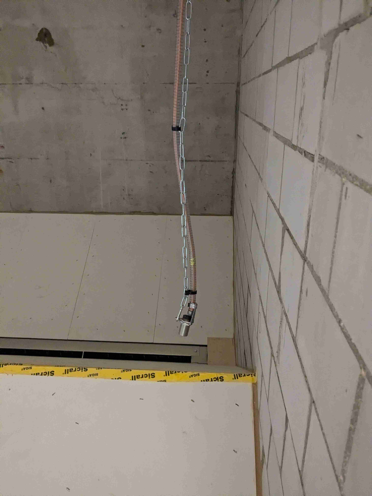
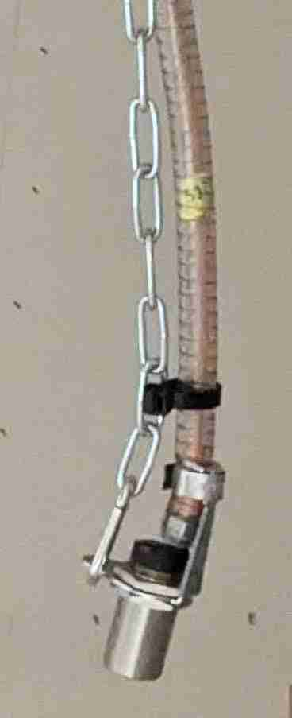
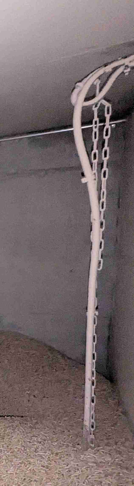
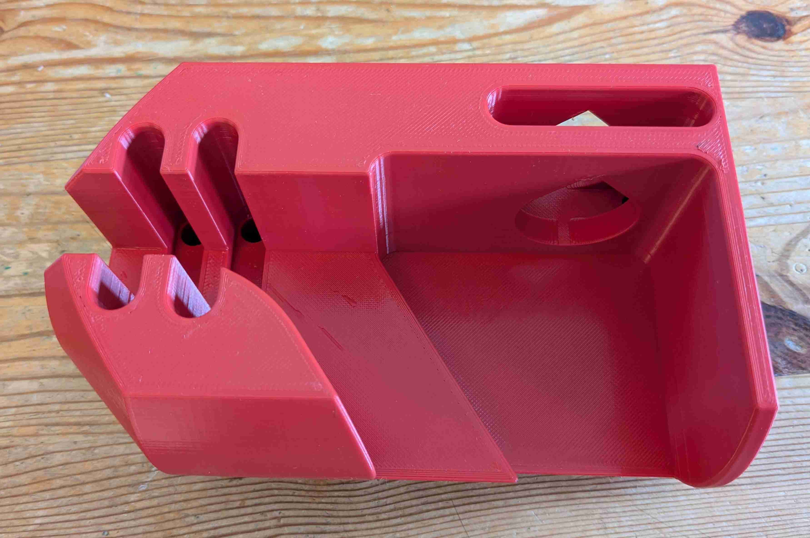
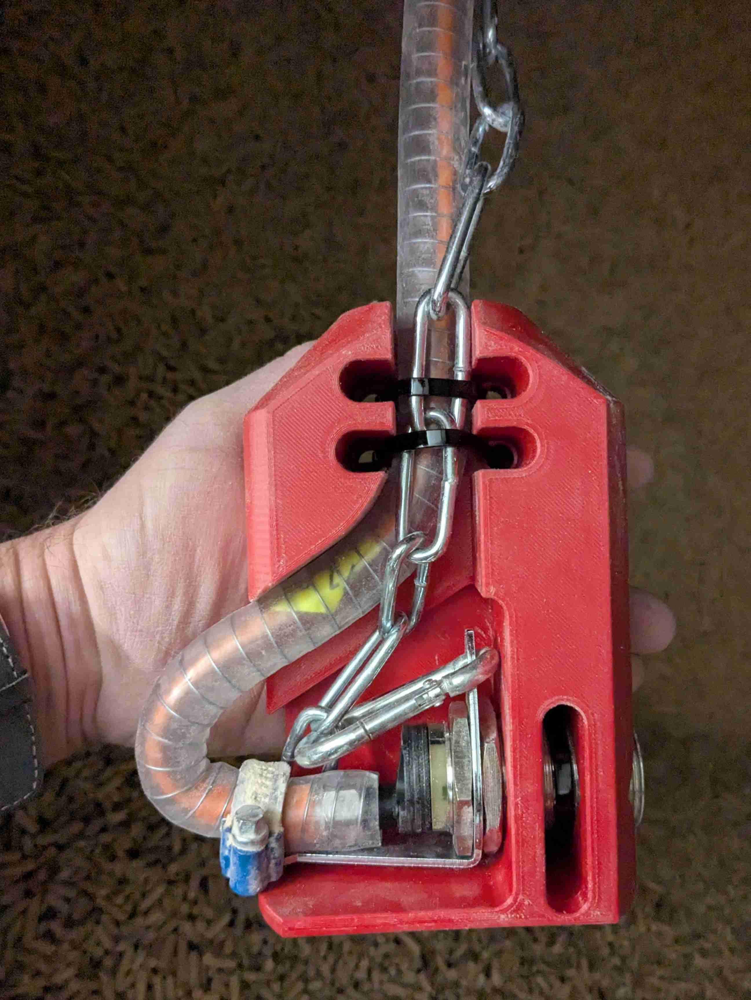
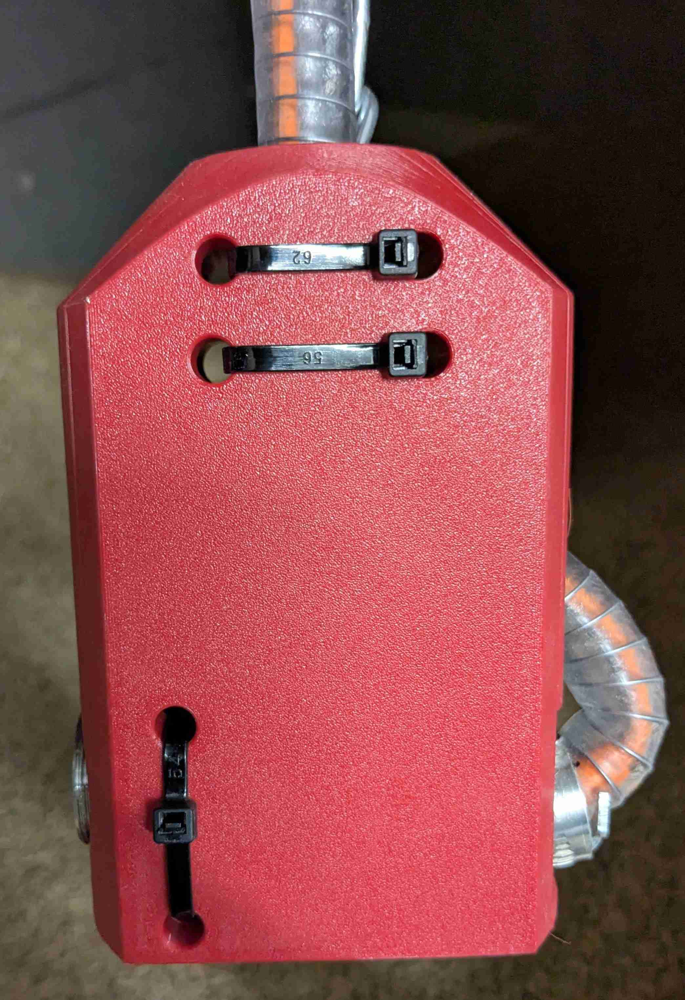
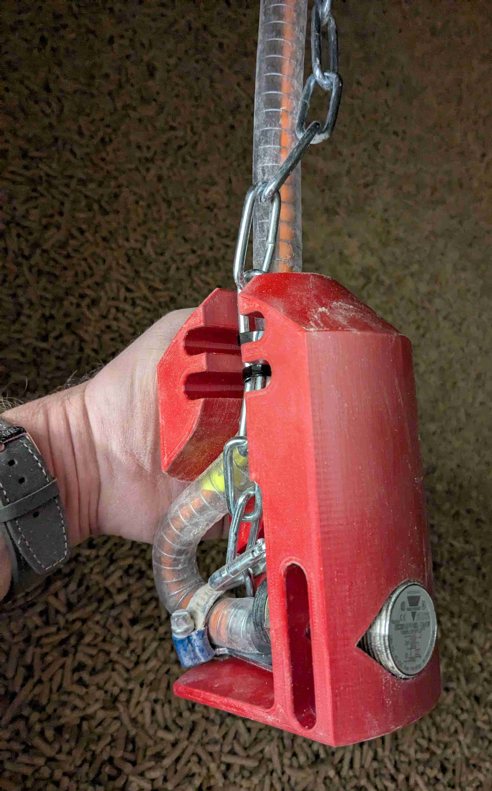
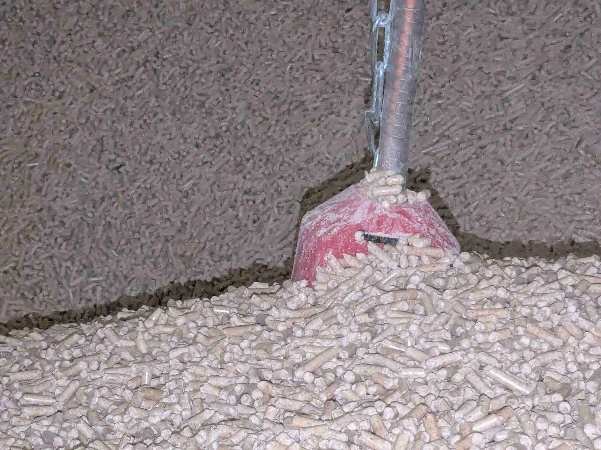
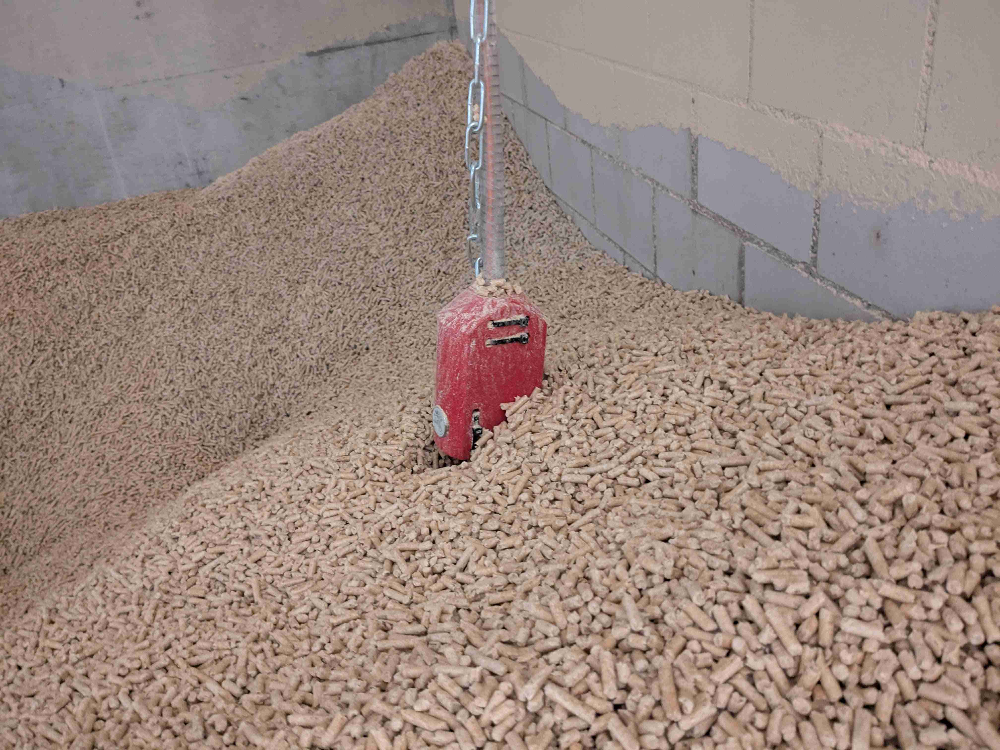

# Pellets-Sensor im Pelletsbunker

Der Pelletssensor arbeitet nicht zuverlässig: Er löste sporadisch zu früh aus. 
 Wenn der Pelletsstand im Pelletsbunker sinkt, so rutschen vermutlich die Pellets am Sensor vorbei und unten, dort wor der Sensor kapazitiv die Pellets erkennen sollte, bildet sich ein Hohlraum: der Sensor sieht keine Pellets mehr.

Pelletssensor original, hängt vertikal in die Pellets.

 
 
Der Pelletssensor hat deutlich zu früh ausgelöst obwohl er noch mit Pellets bedekt ist.

 
 
Wir montieren den Sensor neu horizontal. Die Pellets können dann seitlich am Sensor vorbei rutschen. Seitlich ist der Halter immer mit Pellets bedeckt.

Halter aus Kunststoff.

Sensor im Halter montiert.

 
 
Sensor mit Pellets bedekt.

 
 
Jetzt hat der Sensor ausgelöst, korrekt.

