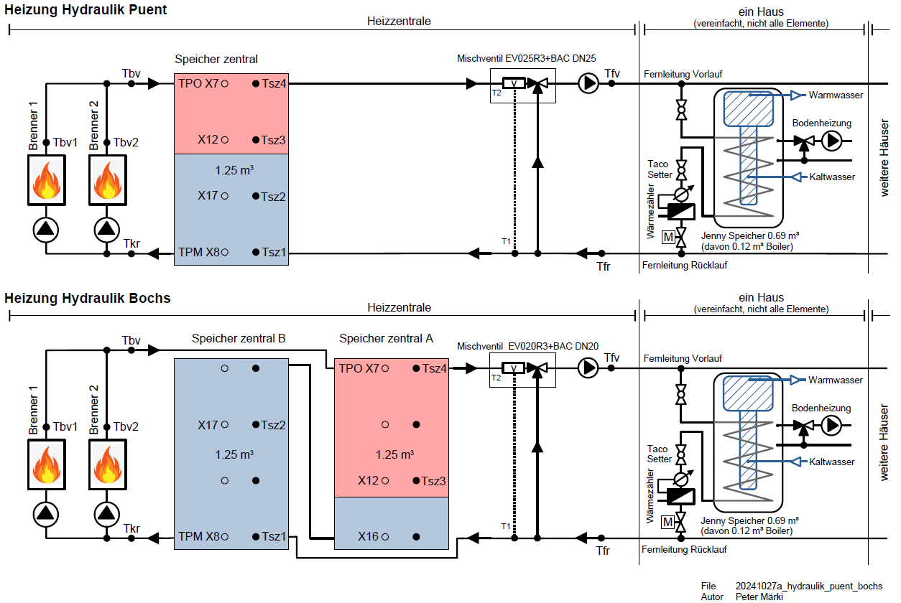

# Bericht

## Ausgangslage

Wir haben zwei Siedlungen. Jede Siedlung hat eine separate Heizzentrale. Hier wurde 2024 die Pelletsheizung ersetzt. 
Dezentral, in den Häusern, ist in jedem Haus ein Wärmespeicher. Von diesem wird Heizwärme und Brauchwasser bezogen.

||Puent|Bochs| |
|---|---|---|---|
|Häuser pro Etappe|15|11|Häuser|
|Speicher dezentral, je Haus|0.69|0.69|m3|
|Speicher dezentral total|10.3|7.6|m3|
|Speicher zentral total|1.25|2.5|m3|
|Heizleistung vor 2024 nominal|70|55|kW|
|Heizleistung nach 2024 nominal|72|72|kW|
|Fernleitung Fluss, alle Ventile offen|2.3|1.7|m3/h|
|Fernleitungspumpe  Druck |0.5|0.5|bar|

Hydraulikschema, vereinfacht

Die Wärmespeicher in den Häsuern haben ein Register (Wärmetauscher mit einem Rohr im Speicher). Das Wasser von der Heizzentrale ist daher nicht das gleiche Wasser wie jenes in der Bodenheizung von einem Haus. Das Brauchwasser (Duschen, Baden, Waschen) befindet sich in einem Chromstahltank (integrierte Warmwasserboiler) im Wärmespeicher.

Der alte Pellets Brenner rauchte oft. Nach vielen Jahren Qualm haben wir uns entschieden, die Brenner zu ersetzen.

## Neu, 2024

Wir haben, je Heizzentrale, den alten Pelletbrenner durch zwei neue Oekofen Pellet Brenner ersetzt. Zudem haben wir neu in der Heizzentrale einen Pufferspeicher.

Die Fernleitung und die dezentralen Anlagen bleiben aus Kostengründen bestehen.

# Erfahrung in den ersten Monaten
Die Installateure haben prima gearbeitet.
Das neue System bringt viele Vorteile.
- Der Pellets-Bunker mit zwei Schnecken hat fast kein Totvolumen mehr (Pellets können komplett geleert werden.)
- Die zwei Brenner PESK41 von Oekofen laufen prima. Was aus dem Kamin kommt sieht nach feuchter Luft aus, weisser Rauch. Keine merklichen Geruchsemissionen.
- Durch den zusätzlichen zentralen Pufferspeicher können die Brennzyklen reduziert werden.
- Die Steuerung funktioniert. Die Temperaturen aller Speicher, zentral und dezentral werden gemessen. Die Brenner, die Fernleitungspumpe und die Ventile dezentral gesteuert. Weniger Brennzylen, allgmein tiefere Temperaturen und damit einhergehend weniger Verluste: super.
- Wir haben eine Notheizung mit Strom. Das gibt Sicherheit.
- Zwei Brenner, zwei Saugsysteme, zwei Schnecken im Pellets-Bunker. Redundant. Das gibt Sicherheit.
- Die Brenner sind einfach. Ofentüre auf und man sieht das Feuer. 
- Der Brennteller ist elegant. Pellets werden von unten in der Mitte rauf geschoben, kontinuierlicher Prozess. Sieht sauber aus.
- Brennwerttechnik. Die Kamine sind kalt. Vermutlich haben wir einen guten Wirkungsgrad.
- Das Saugen der Pellets durch Schläuche. Brenner frei im Raum aufgestellt. 

Die Steuerung bietet einen "Manuellen" und einen "Automatischen" Betrieb. Der Manuelle läuft ganz ohne Software. Robust dafür nicht so sparsam.

Betrieb alt und neu

- [Alte Heizung, vor 2024](./betrieb_vor_2024/readme.md) 
- [Testbetrieb Manuell](./betrieb_manuell/readme.md) 
- [Testbetrieb Automatik](./betrieb_automatik/readme.md) 

Brenner Oekofen

- [Speicher Bewirtschaftung im Modus Manuell](./speicher_bewirtschaftung/readme.md) 
- [Brenner Startzeit](./brenner_startzeit/readme.md) 
- [Asche und Rauch](./asche_rauch/readme.md) 
- [Modulation der Brenner](./modulation/readme.md) 
- [Interface zu den Brennern](./modbus_relaiskontakte/readme.md) 
- [Pellets zu den Tagesbehältern saugen](./saugen/readme.md) 

Fotos
- [Einige Impressionen](./impressionen/readme.md) 

Nicht alles ist perfekt aber unter dem Strich ist es eine sehr schöne Lösung. Vielen Dank an dieser Stelle an alle die dazu beigetragen haben.

2024 Peter Märki