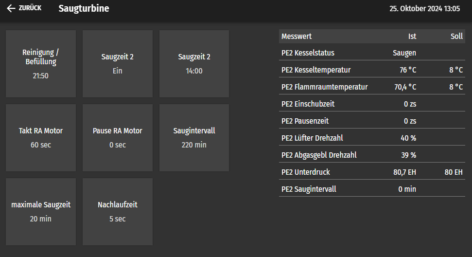
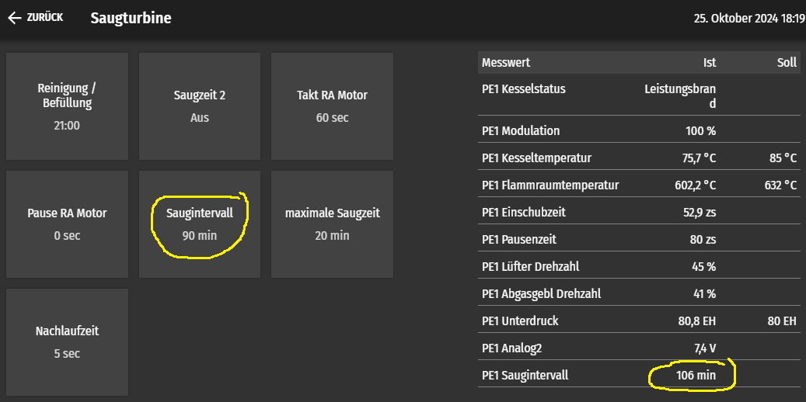
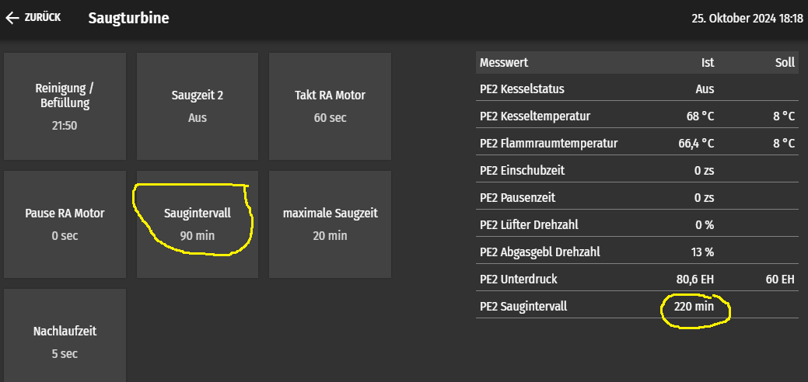
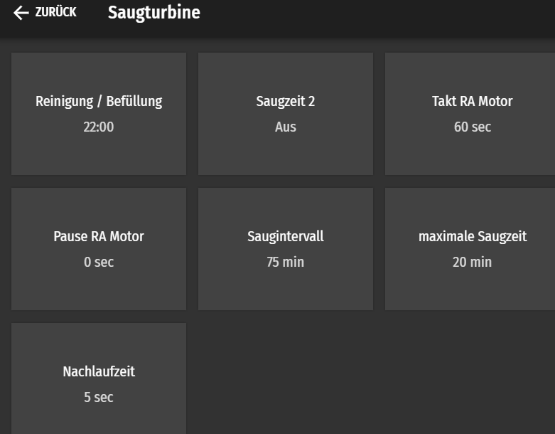

# Saugen

Saugen bedeutet: die Schnecke im Pellets Bunker dreht sich, die Saugturbine saugt die Pellets über die Schläuche in den Tagesbehälter am Brenner.

Seit Wochen haben wir Probleme mit der FlammÜberwachung.

Meldung: "... FlammÜberwachung [5037]"

2024-10-25 13:01 Puent
PE2
Saugen um 7:24
Leistung bricht ein um 12:26, das war
Modulation 100% über 302 Minuten.

Ich würde annehmen, bei einem "Saugintervall" von 220 min hätte PE2 bereits früher saugen müssen.
Komisch.

Im Manual 

Pelletronic_Touch_Fachmann_VA4_2b_E1650DE 1.5.pdf

finde ich "Laufzeit der Brennerschnecke bis zum nächsten Saugintervall." Die Brennerschnecke ist das Ding welches vom Tagesbehälter in den Brennraum fördert. 

Touch, Hauptmenu, Messwerte: Hier sind Einschubzeit und Pausenzeit, vermutlich ist die Einschubzeit wenn die Brennerschnecke läuft.
Typisches Rätselraten ala Oekofen. Und erst noch weil einfach ein zweiter Füllstandsensor unten am Tagesspeicher eingespart wurde? Hmm!
Und obendrein: das Saugintervall wurde scheinbar bei der Installation völlig falsch eingestellt.

Ich lese einfach zu einem Zeitpunkt mit 100% Modulation ab: Einschubzeit 40 zs und Pausenzeit 80 zs (was auch immer zs sein soll.)
Wäre vermutlich ein drittel der Zeit. 
Es hat gereicht für 302 Minuten, daher vermutlich für 302 min / 3 = 100 min Einschubzeit.
Ich ändere das Saugintervall von alt 220 min auf neu 90 min.

4 Stunden später schaue ich nach, hat noch nicht gesaugt.

Ich finde folgende Einstellungen:

PE1 
PE2 

Ein Saugintervall Ist und kein Soll. Das ist nicht selbsteklärend :(
Ich hätte erwartet, dass nach meiner Vorgabe gesogen wird.

Einige Minuten später finde ich PE1 Saugintervall Ist 103 min. Scheint herunter zu zählen. Vermutlich wenn er 0 ist, so saugt er.
Allenfalls ist dieser Zähler nicht korrekt weil ich die Einstellung während dem Brand gemacht habe.
Vermutung: wenn Zähler abgelaufen, so saugt er und nimmt den Wert welchen ich vorgegeben habe und schreibt ihn in den Zähler.
Der Angezeigte Wert wäre dann so etwas wie verbleibende Einschubzeit.

Ich beobachte weiter. Ja, so scheint es zu sein. Nach ca. 4 Stunden Brenndauer ist der Zähler auf 0 und er saugt.

Vorsichtshalber verkleinere ich das Saugintervall auf 75 Minuten weil ich keinenfalls möchte, dass die Pellets ausgehen und der Brenner in Störung geht. Während dem Saugen läuft die UW Pumpe weiter. Vermutlich brennt auch das Feuer brav weiter: also kein grosser Schaden. Nachtrag Januar 2025: beim Saugen brennt das Feuer nicht einfach weiter. Bei langer Saugzeit sehe ich das deutlich in der Leistung.

Neue Einstellung 

Das ist alles nicht tragisch, kostet mich als Kunde trotzdem etliche Stunden.