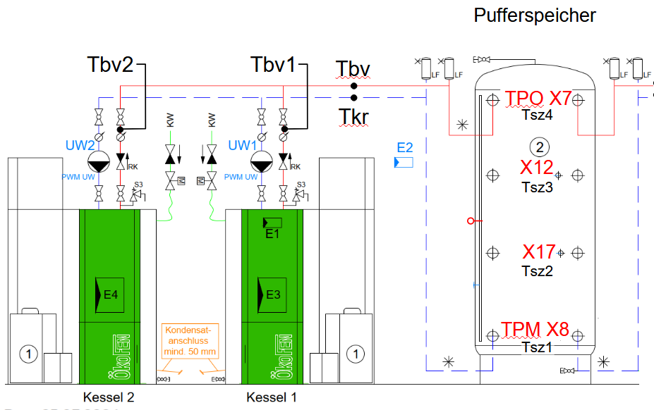
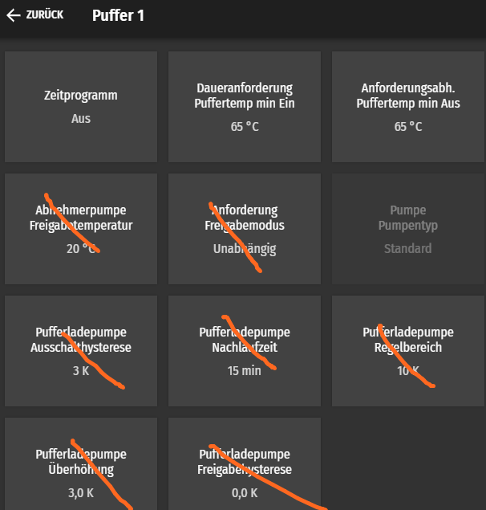
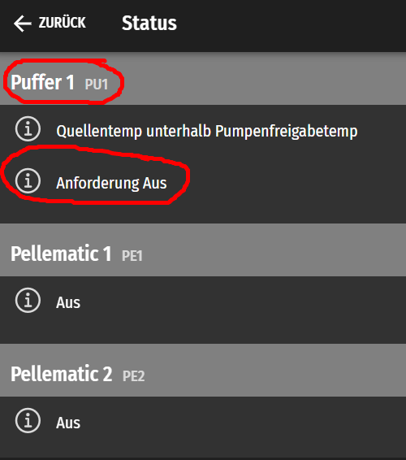
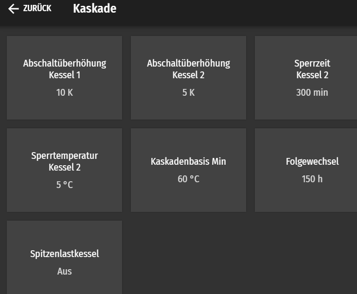
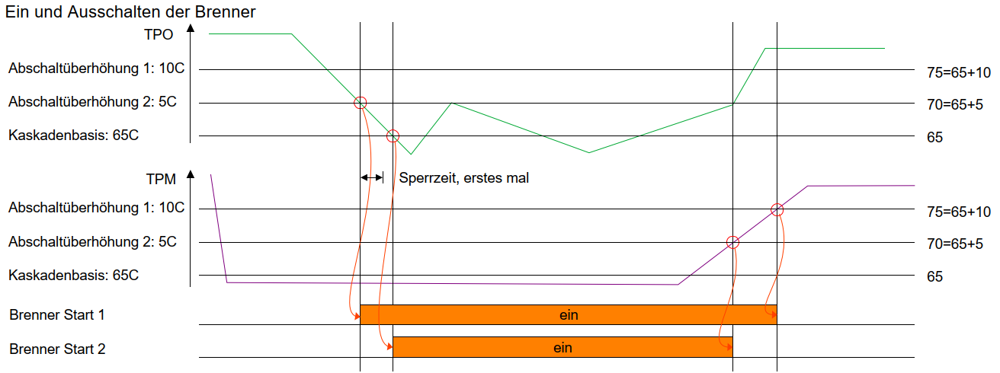
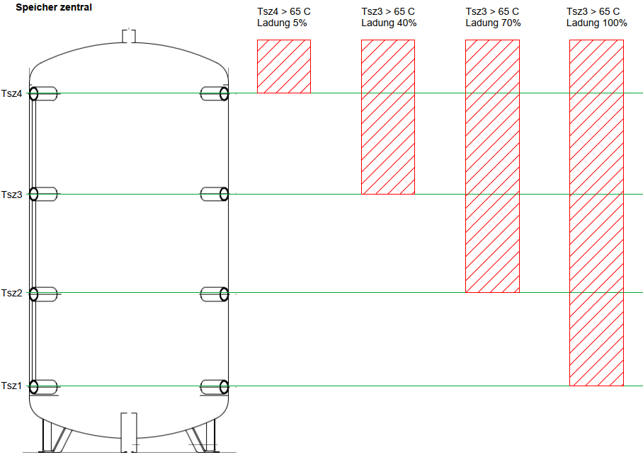
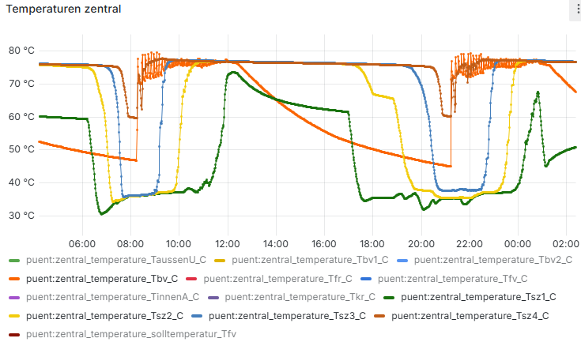

# Speicher-Bewirtschaftung
Touch V.4.04

Ich verstehe vieles nicht wirklich. Auch bei Xten mal durchlesen der Unterlagen verstehe ich das Konzept nicht richtig. Unterschiedliche Bezeichnungen für dieselben Sachen helfen auch nicht weiter. Was ich hier wieder gebe, ist nach bestem Wissen und Gewissen und durch Ausprobieren ermittelt worden.

Wir haben zwei Brenner "in Kaskade" mit einem Pufferspeicher.
Für die Speicherbewirtschaftung von Oekofen sind bei uns nur die Temperatursensoren TPO X7 und TPM X8 wichtig.

Bei unserer Anwendung liefern die Brenner heisses Wasser mit fix 75C. 
Je nach Modulation und je nach Anzahl Brenner kommt mehr oder weniger heisses Wasser. Siehe auch separates Kapitel Modulation.

Menu Puffer1
- Daueranforderung Puffertemp min Ein: unterschreitet TPO 65 C, so geht Anforderung auf Ein
- Daueranforderung Purrertemp in Aus: überschreitet TPM 65C, so geht Anforderung auf Aus

Menu Status, Puffer1, hier sehe ich ob es eine Anforderung gibt

## Schalten der Brenner
Bei einer Anforderung startet der erste Brenner. Bleibt die Anforderung länger
als "Sperrzeit Kessel 2" bestehen, so startet der zweite Brenner.

Menu Systemregelung Kaskade

Meine Vermutung wie die Schaltschwellen wirken

Wir haben zwei Brenner, 1 und 2 und einen Brenner der als erster Startet und einer der als zweiter Startet. Hier wurden in den Unterlagen und in der Bedienung beide Male 1 und 2 verwendet.
Liebe Entwickler, hier würde ich mir wünschen:
- Physikalische Brenner wie sie vor mir stehen: Pe1 und Pe2
- Reihenfolge der Brenner wie sie gezündet werden: PeA und PeB

Mit einer solchen Unterscheidung der Namen wäre vieles einfacher zu verstehen. 

Damit die Brenner gleichmässig altern, alterniert die Reihenfolge wie die Brenner gezündet werden. z.B. PeA = Pe1 und PeB = Pe2, später wäre es PeA = Pe1 und PeB = Pe2.

Im Moment haben wir Herbst und es läuft nur ein Brenner. Wie das mit zwei Brennern klappt werde ich erst noch sehen.

## Speicher wird mit 100% Modulation gefüllt

Bei einer Anforderung startet der erste Brenner und füllt den Speicher mit 100% Modulation.
Dann schaltet der Brenner wieder aus. Das ist einfach aber nicht optimal. Kurze Brennzeiten, viele Brennstarts.

## Wunschdenken: Speicher wird bewirtschaftet

Ich würde mir folgende Regel wünschen:
- Bei einer Anforderung (TPO < 65C) startet der erste Brenner mit 100% Modulation
- Sobald TPO 70C überschreitet, wird die Modulation reduziert. TPO wird damit auf mindestens 70C gehalten, jene Temperatur welche wir bei uns brauchen. Unterschreitet TPO 70C, so wird die Modulation wieder erhöht.
- Kann der erste Brenner die 70C bei TPO über längere Zeit nicht erreichen, so startet der zweite Brenner

Brennleistung und Bezug halten sich die Waage
> Mit dieser einfachen Regel würde die Brennleistung (Modulation und Anzahl Brenner) aufgrund des Leistungsbezugs geregelt ohne den Speicher zu laden. Die Grenze von 70C wäre immer bei TPO, oben am Speicher.
Vom Brenner kommt Wasser mit 75C, der Bezüger kriegt die Mischtemperatur von 70C. Mischtemperatur von 75C und vom Rücklauf 40C welcher durch den Speicher nach oben strömt.

Brennerleistung höher als Bezug
> Ein Brenner brennt, der Bezug ist weniger als 30% Leistung eines Brenners. (30% ist die minimale Modulation). 
In diesem Fall wird der Speicher geladen. Eine Heisswassersäule von 75C wächst von oben im Speicher nach unten. Wenn das 75C Wasser unten im Speicher, bei TPM ankommt, so wird der Brenner gelöscht.

Mit dieser Regel würde gemäss Bedarf die Brenner moduliert. Viel längere Brennzeiten, weniger Brennerstarts.
Schade geht das nicht.

Natürlich gibt es Detailprobleme. Beispiel: zwei Brenner brennen, der Bezug sinkt, beide laufen auf 30%. Soll einer gelöscht werden damit der andere auf 60% alleine weiter brennt...usw.

Nur mit dem Wissen um Wirkungsgrad und Abgaswerte in Abhängigkeit der Modulation kann hier ein cleverses System gemacht werden. Und das weiss ich halt nicht.
Würde mir das zur Verfügung gestellt, und hätte ich eine elegante Möglichkeit die Modulation vor zu geben, so würde ich das gerne von Aussen realisieren.
Liebe Entwickler: ich denke hier wäre viel Potential.

## Speicher, heisse Wassersäule

Mir war früher nicht bewusst, wie sauber so ein Speicher schichtet. Deshalb gehe ich nochmals darauf ein.

Ich habe Rücklaufwasser von 40C. Ein leerer Speicher hat daher überall Wasser mit 40C. Fülle ich den Speicher mit 75C Wasser, so schiebt sich ein heisser Wasserzylinder von oben nach unten. Weil ich nur 4 Temperatursensoren habe (hat nichts mit Oekofen zu tun, diese Sensoren sind von mir), kann ich erkennen wenn das 75C Wasser beim Sensor vorbei kommt.

Ich erkenne also:
- Tsz4 unter 75C: der oberste Teil vom Speicher, oberhalb von Tsz4 ist voll oder auch nicht. "0% bis 5% Ladung"
- Tsz4 über 75C, Tsz3 utner 75C: die Wassersäule ist zwischen Tsz4 und Tzs3. Ich habe zwischen "5% und 40% Ladung"
- usw.

Meine Messung mit "nur" vier Sensoren führt zu einer groben Quantisierung.

Hier die Temperaturen über die Zeit:

Je nach Vergangenheit sind die Phasengrenzen schärfer oder weniger scharf.

- 08:10, der Brenner startet und liefert Wasser von 75C, orange, Tbv_C, Vorlauf vom Brenner.
- 09:00, blau, Tsz3 steigt, der Speicher ist also zu 40% gefüllt.
- 10:00, gelb, Tsz2: Speicher zu 70% gefüllt.
- 12:00, grün, Tsz1, Speicher zu 100% voll. Der Brenner löscht.
- anschliessend sinkt orange Tbv_C ab weil der Brenner aus ist und die Temperatur der Wasserleitung mit dem Sensor abkühlt.
- der Speicher wird anschliessend entladen. Die teilweise sichtbaren Stufen entstehen durch nicht konstanten Bezug vom Speicher (im Bild nicht sichtbar).
- 21:00 der Brenner startet wieder

Für mich ist der Ladestand des zentralen Speichers wichtig. Ich steuere die Bezüger und die Brenner, der zentrale Speicher gibt mir Zeit um zu reagieren. Die grobe Quantisierung durch die wenigen Sensoren ist unpraktisch.
Wieder was gelernt; ich hätte mehr Sensoren einbauen sollen.