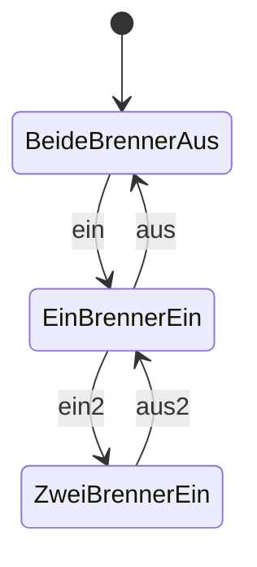

# Konzept Brennzyklen minimieren
```
energiemangel = ladung_minimum von einem Haus < 0% and  TPO_C < 60C
```
## Zünden verhindern
Brenner dürfen nur bei energiemangel anlaufen.
```
if not energiemangel:
    if brenner_1 aus:
        relais_2 True # brenner_1 sperren
    if brenner_2 aus:
        relais_4 True # brenner_2 sperren
else:
    relais_2 False # brenner_1 nicht sperren
    relais_4 False # brenner_2 nicht sperren
```
TPO_ein_C = 65
TPO_mod_30_C # ab dieser Temperatur moduliert der Brenner auf 30%
TPM_aus_C = 60

## Zentralspeicher nicht unterkühlen durch zu viel Energiebezug vom zentralen Speicher

TPO_C hat normalerweise über 65C. Falls TPO_C zu tief geht, so kann der brenner nicht genügend Wärme liefern.
```
falls geladen wird und die Pumpe läuft
    if TPO_C < TPO_ein_C -2.0: Pumpe aus
    if TPO_C > TPO_ein_C -2.0: wieder ein
```
Bei energiemangel wird Oekofen den ersten brenner starten falls TPO_C unter 60 ist oder nach zwei Stunden den zweiten brenner starten.

## Modulation optimal
Falls alle Häuser ladung_minimum > 0
Modulation optimal halten.
```
falls mindestens ein Brenner brennt und geladen wird und die Pumpe läuft
    if TPO_C < TPO_mod_30_C : Pumpe aus
    if TPO_C > TPO_mod_30_C : Pumpe wieder ein

alternativ
    weniger oder mehr Energie beziehen zu und wegschalten von Häusern
```

## Auslöschen verhindern

Wenn der zentrale Speicher bei TPM_C zu warm ist, so löscht Oekofen einen Brenner, später den zweiten.

Mir ist noch unklar ob ich mit einer Wärmeanforderung über relais_3 das verhindern kann.

```
if TPM_C > 45 C:
    mehr Energie beziehen durch Laden zusätzliche Häuser
```


# Übergänge



* Einfluss: 'aus': Sperren via Relay
* Einfluss: 'aus': State 'TPM > 60C'
* Einfluss: 'ein': State 'TPO < 65C'
* Einfluss: 'ein2': State 'TPO < 65C' für mehr als 2h


