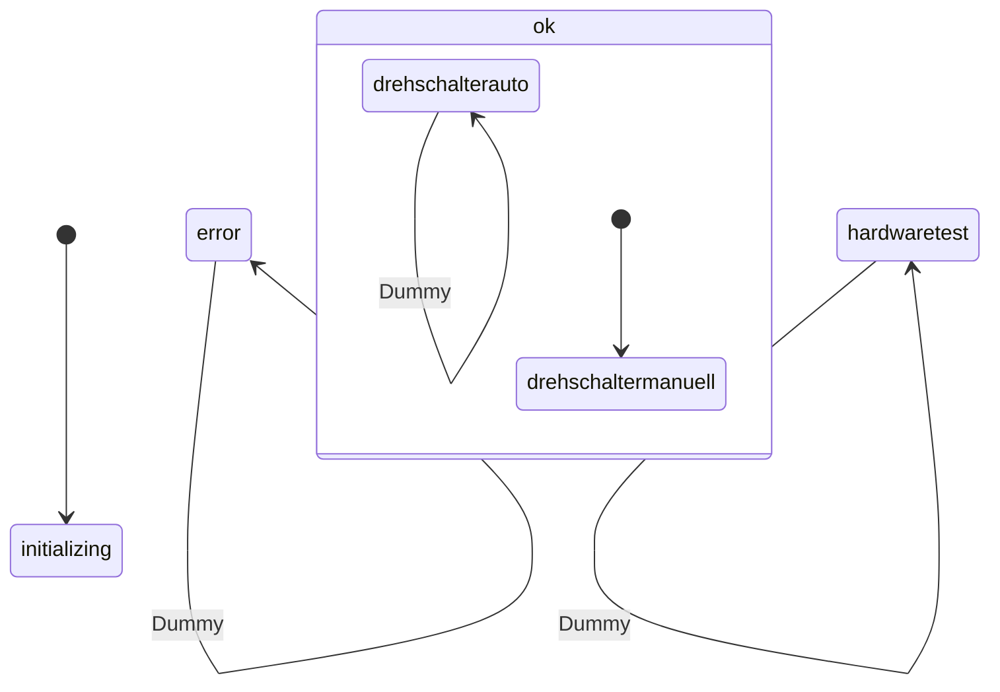

```mermaid
stateDiagram-v2
    error: error
    state error
    error --> error: Dummy

    hardwaretest: hardwaretest
    state hardwaretest
    hardwaretest --> hardwaretest: Dummy

    initializing: initializing
    state initializing

    ok: ok
    state ok {
        ok_drehschalterauto: drehschalterauto
        state ok_drehschalterauto
        ok_drehschalterauto --> ok_drehschalterauto: Dummy

        ok_drehschaltermanuell: drehschaltermanuell
        state ok_drehschaltermanuell
        [*] --> ok_drehschaltermanuell
    }
    [*] --> initializing

    %% Transitions
```
