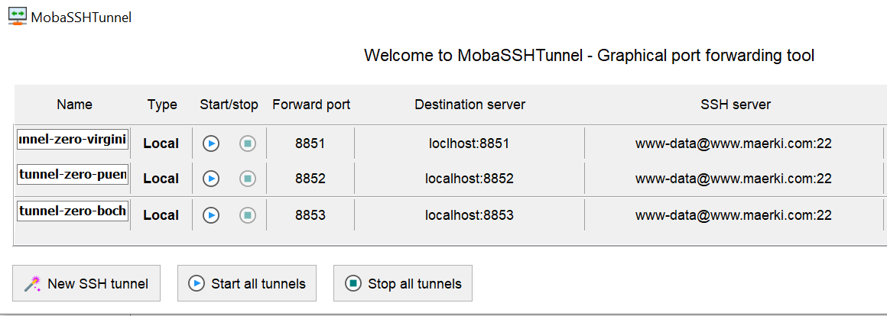
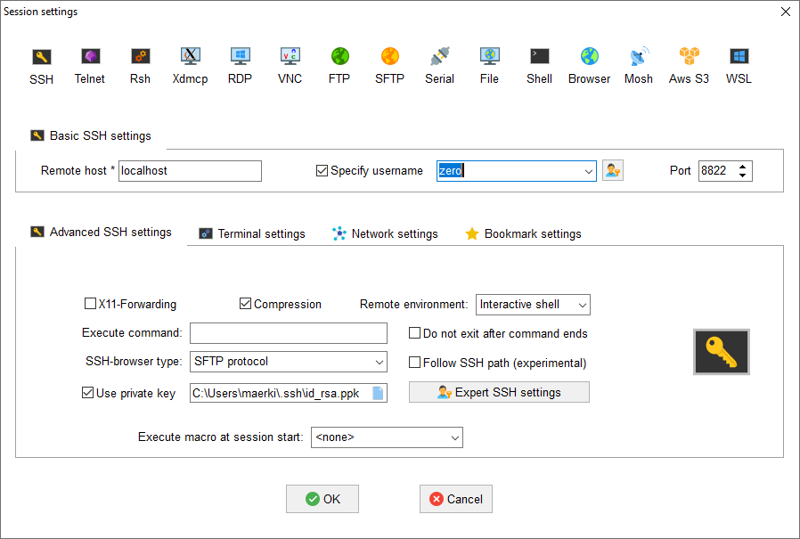

# SSH Tunnel from Office into Heizung (Windows)

OBSOLETE, see [822_pc-win-ssh-tunnel.md](822_pc-win-ssh-tunnel.md)

## Prepare keys

Make sure your public and privat key is present:
```
C:\Users\maerki\.ssh\id_rsa.pub
C:\Users\maerki\.ssh\id_rsa.ppk
```

Make sure your public key is known to the zero:

`C:\Users\maerki\.ssh\id_rsa.pub`
must be one line in
`<repo>/keys/authorized_keys`

## Prepare `C:\Users\maerki\.ssh\config`

Copy lines from the template [822_pc-template-ssh-config.txt](822_pc-template-ssh-config.txt).


## Configure ssh tunnels

pc-win: Mobaxterm: Menu `Tools` -> `MobaSSHTunnel` -> `New SSH Tunnel`


For `tunnel-zero-virgin` use port `8851`.

Repeat this step for
`DICT_SSH_TUNNEL_PORT` in [utils_constants.py](../utils_common/utils_constants.py)

You may start a tunnel in this screen




<!-- ## Configure ssh session



Name this session `zero@zero-puent`

Repeat this step for
`DICT_SSH_TUNNEL_PORT` in [utils_constants.py](../utils_common/utils_constants.py) -->

<!-- ## Start ssh terminal

Start first the tunnel and then the session. -->

## Work with VSCode

Start the tunnel: In MobaXterm: Start tunnel

In VSCode: `>Remote-SSH: Connect to Host` -> `zero-puent_maerki.com`

This now should connect VSCode.
