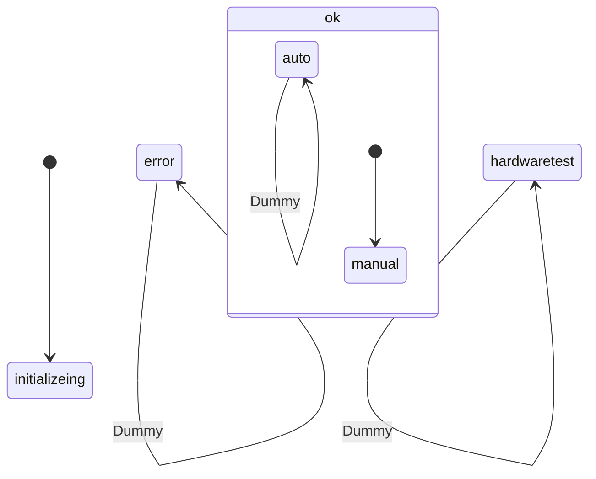

```mermaid
stateDiagram-v2
    error: error
    state error
    error --> error: Dummy

    hardwaretest: hardwaretest
    state hardwaretest
    hardwaretest --> hardwaretest: Dummy

    initializeing: initializeing
    state initializeing

    ok: ok
    state ok {
        ok_auto: auto
        state ok_auto
        ok_auto --> ok_auto: Dummy

        ok_manual: manual
        state ok_manual
        [*] --> ok_manual
    }
    [*] --> initializeing

    %% Transitions
```
