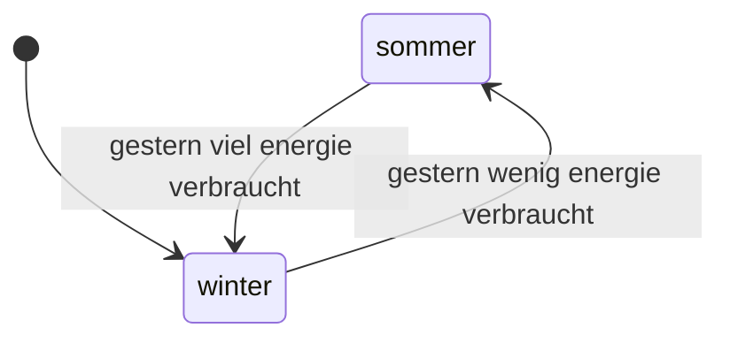

```mermaid
stateDiagram-v2
    sommer: sommer
    state sommer

    winter: winter
    state winter
    [*] --> winter

    %% Transitions
    sommer --> winter: gestern viel energie verbraucht
    winter --> sommer: gestern wenig energie verbraucht
```
