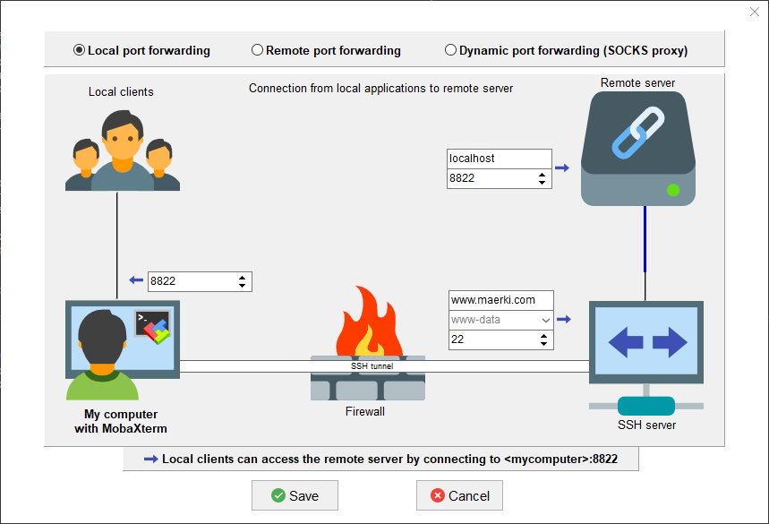

# Use Mobaxterm to connect to zero

## TODO: Prepare keys

Make sure your public and privat key is present:
```
C:\Users\maerki\.ssh\id_rsa.pub
C:\Users\maerki\.ssh\id_rsa.ppk
```

Make sure your public key is known to the zero:

`C:\Users\maerki\.ssh\id_rsa.pub`
must be one line in
`<repo>/keys/authorized_keys`

## TODO: Configure ssh tunnels

pc-win: Mobaxterm: Menu `Tools` -> `MobaSSHTunnel` -> `New SSH Tunnel`



Name this `tunnel-zero-puent`.

Do the same with port 8823 and name it `tunnel-zero-bochs`.

## TODO: Configure ssh session


Name this session `zero@zero-puent`

Do the same with port 8823 and name it `zero@zero-bochs`.

## TODO: Start ssh terminal

Start first the tunnel and then the session.

