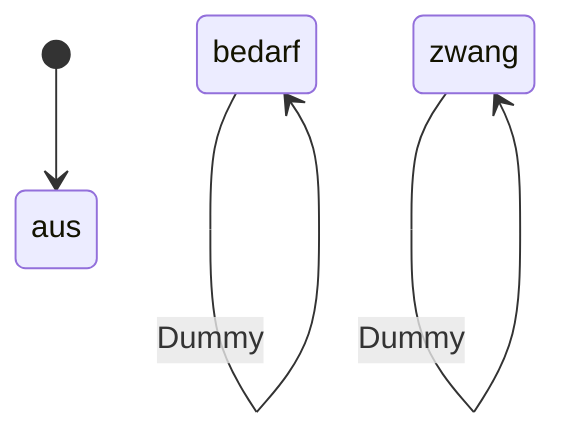

```mermaid
stateDiagram-v2
    aus: aus
    state aus

    bedarf: bedarf
    state bedarf
    bedarf --> bedarf: Dummy

    zwang: zwang
    state zwang
    zwang --> zwang: Dummy
    [*] --> aus

    %% Transitions
```
