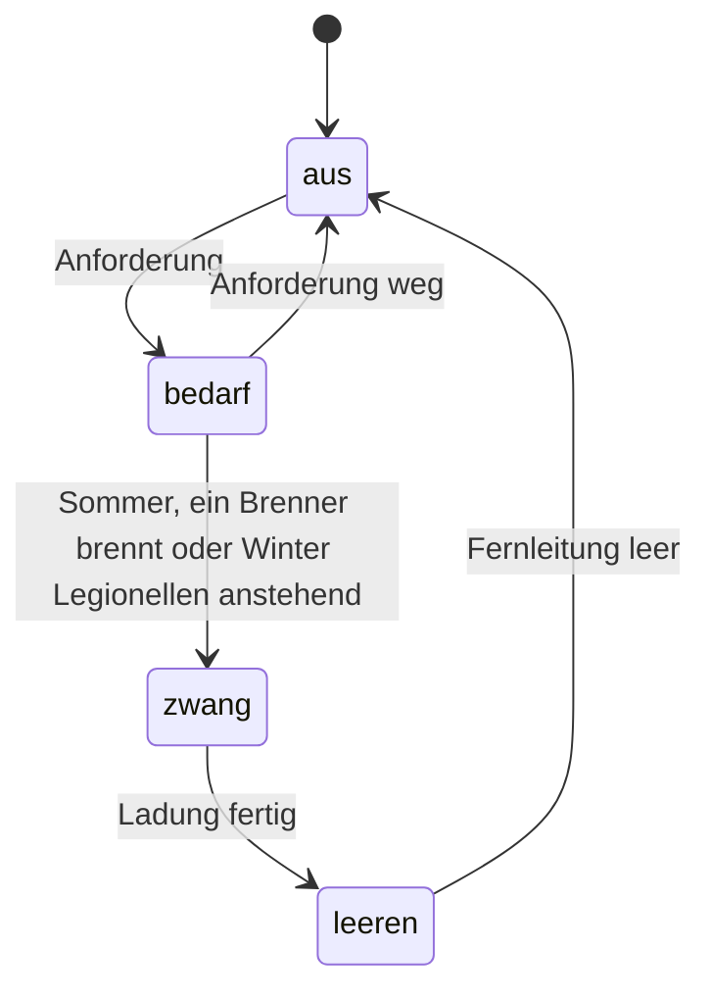

```mermaid
stateDiagram-v2
    aus: aus
    state aus

    bedarf: bedarf
    state bedarf

    leeren: leeren
    state leeren

    zwang: zwang
    state zwang
    [*] --> aus

    %% Transitions
    aus --> bedarf: Anforderung
    bedarf --> aus: Anforderung weg
    bedarf --> zwang: Sommer, ein Brenner brennt oder Winter Legionellen anstehend
    leeren --> aus: Fernleitung leer
    zwang --> leeren: Ladung fertig
```
