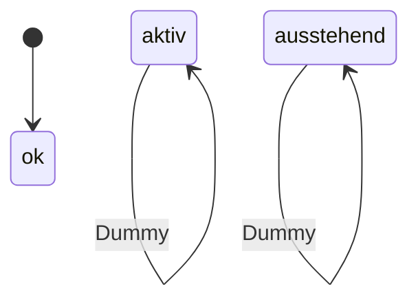

```mermaid
stateDiagram-v2
    aktiv: aktiv
    state aktiv
    aktiv --> aktiv: Dummy

    ausstehend: ausstehend
    state ausstehend
    ausstehend --> ausstehend: Dummy

    ok: ok
    state ok
    [*] --> ok

    %% Transitions
```
