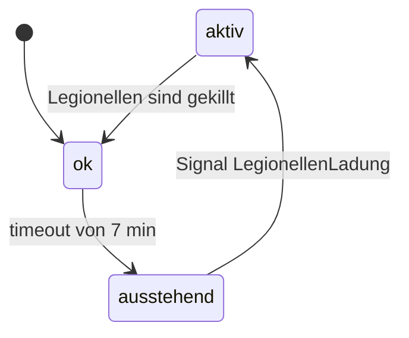

```mermaid
stateDiagram-v2
    aktiv: aktiv
    state aktiv

    ausstehend: ausstehend
    state ausstehend

    ok: ok
    state ok
    [*] --> ok

    %% Transitions
    aktiv --> ok: Legionellen sind gekillt
    ausstehend --> aktiv: Signal LegionellenLadung
    ok --> ausstehend: timeout von 7 min
```
