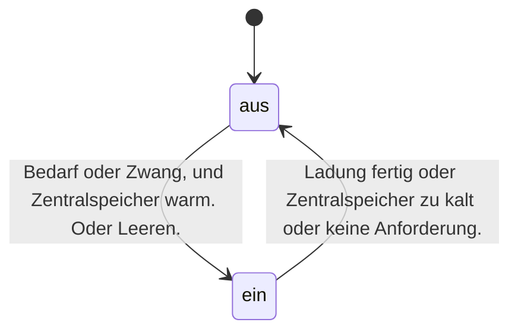

```mermaid
stateDiagram-v2
    aus: aus
    state aus

    ein: ein
    state ein
    [*] --> aus

    %% Transitions
    aus --> ein: Bedarf oder Zwang, und Zentralspeicher warm. Oder Leeren.
    ein --> aus: Ladung fertig oder Zentralspeicher zu kalt oder keine Anforderung.
```
