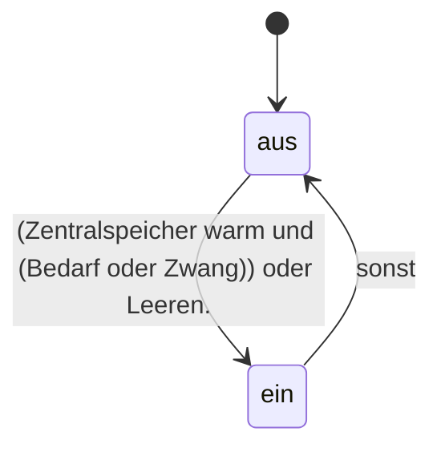

```mermaid
stateDiagram-v2
    aus: aus
    state aus

    ein: ein
    state ein
    [*] --> aus

    %% Transitions
    aus --> ein: (Zentralspeicher warm und (Bedarf oder Zwang)) oder Leeren.
    ein --> aus: sonst
```
